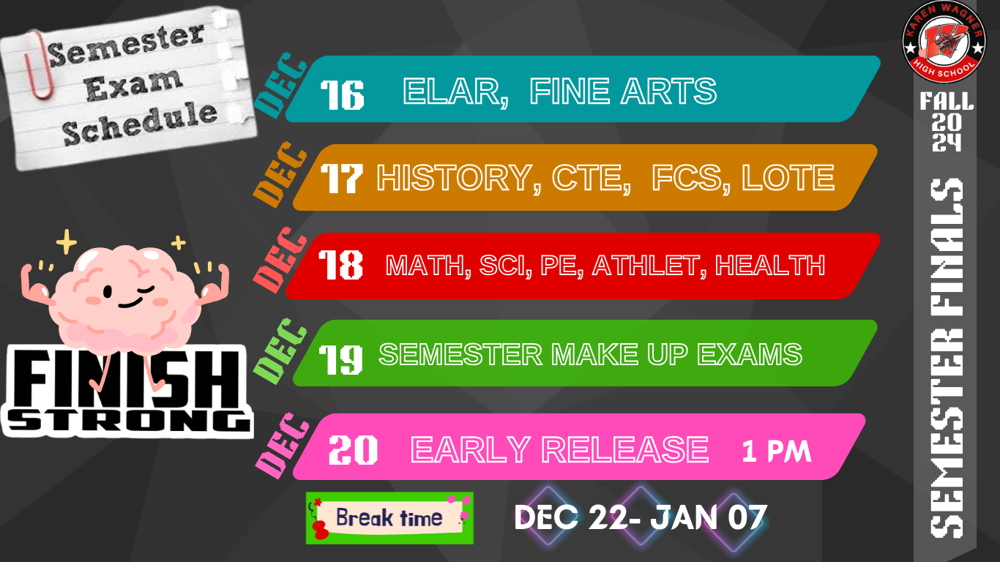

# February 5, 2025

## Agenda

### 1. Late Work Policy

- Complete the **Late Work Policy** assignment on Canvas, acknowledging that you understand this policy will be enforced, effective today.

### 2. Hello World: Emoji

- To access the assignment, **you must log into Code.org using your Clever account**. Please do the following:
    - Visit this [link](https://clever.com/oauth/district-picker?client_id=2f27405716644a951b23&redirect_uri=https%3A%2F%2Fstudio.code.org%2Fusers%2Fauth%2Fclever%2Fcallback&response_type=code&state=ede33ff61289cf32708a0f54079cdd23e31d0b0a02b0e0e8).
    - Search for **Karen Wagner**.
    - Log in with Google using your school email address.
    - Complete **Hello World: Emoji**.

- **If you're already logged in** and cannot find the assignment, you can use this [link](https://studio.code.org/s/hello-world-emoji-2021).
 
### 3. Code with Anna and Elsa

- Complete [Code with Anna and Elsa](https://github.com/mswhitby/classroom/blob/main/_docs/classes/4th.md#1-code-with-anna-and-elsa) if you did not finish yesterday.

### 4. Journal

- Complete your journal entry for this week if you have not completed it yet.
- The journal entry was assigned Monday, February 3, 2025.
- At least 20 people spelled "February" incorrectly (I'm not sure who; I just know how many people). If you did not receive credit for your journal, please check your heading.
- You must email me to let me know you've submitted your journal late. If you do not email me, your journal entry may not be graded.

### 5. Vote for Marcus Johnson!

Please click on the link or scan the QR code below to vote for Wagner's very own **Marcus Johnson** as the Army National Guard People's Choice Player for the Valero All Star basketball game!

[Vote Here!](https://woobox.com/hzdfnk)


----

# February 4, 2025

## Agenda

### 1. Code with Anna and Elsa

- To access the assignment, **you must log into Code.org using your Clever account**. Please do the following:
    - Visit this [link](https://clever.com/oauth/district-picker?client_id=2f27405716644a951b23&redirect_uri=https%3A%2F%2Fstudio.code.org%2Fusers%2Fauth%2Fclever%2Fcallback&response_type=code&state=ede33ff61289cf32708a0f54079cdd23e31d0b0a02b0e0e8).
    - Search for **Karen Wagner**.
    - Log in with Google using your school email address.
    - Complete **Code with Anna and Elsa**.

- **If you're already logged in** and cannot find the assignment, you can use this [link](https://studio.code.org/s/frozen).

### 2. Journal

- Complete your journal entry for this week if you have not completed it yet.
- The journal entry was assigned Monday, February 3, 2025.
- At least 20 people spelled "February" incorrectly (I'm not sure who; I just know how many people). If you did not receive credit for your journal, please check your heading.
- You must email me to let me know you've submitted your journal late. If you do not email me, your journal entry may not be graded.

<!-- ### 3. Vote for Marcus Johnson!

Please click on the link or scan the QR code below to vote for Wagner's very own **Marcus Johnson** as the Army National Guard People's Choice Player for the Valero All Star basketball game!

[Vote Here!](https://woobox.com/hzdfnk)


 -->

----

# February 3, 2025

## Agenda

### 1. Journal 

On January 29, a tragic mid-air collision occurred over Washington, D.C., claiming the lives of 67 people, including military personnel and young athletes returning from a competition. While we mourn this loss, tragedies like this also push us to examine what went wrong and how we can prevent similar events in the future. In aviation, technology plays a crucial role in ensuring safety—yet when systems fail, the consequences can be devastating.

Technology is a key part of modern aviation, from air traffic control systems to automated flight assistance. However, even the most advanced systems can fail. Based on the recent mid-air collision over Washington, D.C., discuss how Computer Science contributes to aviation safety. Consider software development, automation, cybersecurity, or human-computer interaction. What improvements could be made to prevent accidents like this in the future?

**Possible Connections to Computer Science**

1.  **Air Traffic Control Systems** – How do computer algorithms manage airspace and prevent collisions?
2. **Automation & AI in Aviation** – The role of autopilot systems, real-time alerts, and AI-driven decision-making.
3. **Software Errors & Bugs** – How can coding flaws or miscommunication between different software systems contribute to accidents?
4. **Human-Computer Interaction (HCI)** – Did poor interface design or unclear alerts play a role in the crash?
5. **Cybersecurity in Aviation** – Could hacking, jamming, or cyber vulnerabilities pose risks in air traffic management?
6. **Big Data & Predictive Analytics** – How could machine learning be used to predict and prevent accidents?

Write two (2) paragraphs exploring how technology can integration can provided for increased aviation safety. You can use one or more of the six areas listed above, or you can choose another relevant topic of your interest. 

<!-- ### 2. Vote for Marcus Johnson!

Please click on the link or scan the QR code below to vote for Wagner's very own **Marcus Johnson** as the Army National Guard People's Choice Player for the Valero All Star basketball game!

[Vote Here!](https://woobox.com/hzdfnk)


 -->

# January 31, 2025

## Agenda

### 1. Missing Assignments

Make up any assignments that you have not yet completed. You should be finished with:

- [Star Wars: Building a Galaxy With Code](https://github.com/mswhitby/classroom/blob/main/_docs/classes/4th.md#january-30-2025)
- [Flappy Code](https://github.com/mswhitby/classroom/blob/main/_docs/classes/4th.md#1-flappy-code)
- [Hello World: Transformers One](https://github.com/mswhitby/classroom/blob/main/_docs/classes/4th.md#january-28-2025)
- [Disney Infinity Play Lab](https://github.com/mswhitby/classroom/blob/main/_docs/classes/4th.md#january-23-2025)
- [Moneyball Questions](https://github.com/mswhitby/classroom/blob/main/_docs/classes/4th.md#january-15-2025)
- [Code your own sports game](https://github.com/mswhitby/classroom/blob/main/_docs/classes/4th.md#january-10-2025)
- [Minecraft: Voyage Aquatic](https://github.com/mswhitby/classroom/blob/main/_docs/classes/4th.md#january-9-2025)

All assignments are also posted on Canvas.

### 2. Missing Journals

You can find all assigned journal prompts [here](https://github.com/mswhitby/classroom/blob/main/_docs/resources/journal.md). Use this time to make up any journal entries that you've missed. The journals assigned on the following dates are the only entries that can still be submitted:

- [January 27, 2025](https://github.com/mswhitby/classroom/blob/main/_docs/resources/journal.md#january-27-2025)
- [January 22, 2025](https://github.com/mswhitby/classroom/blob/main/_docs/resources/journal.md#january-22-2025)
- [January 13, 2025](https://github.com/mswhitby/classroom/blob/main/_docs/resources/journal.md#january-13-2025)
- [January 8, 2025](https://github.com/mswhitby/classroom/blob/main/_docs/resources/journal.md#january-8-2025)

### 3. Vote for Marcus Johnson!

Please click on the link or scan the QR code below to vote for Wagner's very own **Marcus Johnson** as the Army National Guard People's Choice Player for the Valero All Star basketball game!

[Vote Here!](https://woobox.com/hzdfnk)


----

# January 30, 2025

## Agenda

### 1. Star Wars: Building a Galaxy With Code

- To access the assignment, **you must log into Code.org using your Clever account**. Please do the following:
    - Visit this [link](https://clever.com/oauth/district-picker?client_id=2f27405716644a951b23&redirect_uri=https%3A%2F%2Fstudio.code.org%2Fusers%2Fauth%2Fclever%2Fcallback&response_type=code&state=ede33ff61289cf32708a0f54079cdd23e31d0b0a02b0e0e8).
    - Search for **Karen Wagner**.
    - Log in with Google using your school email address.
    - Complete **Star Wars: Building a Galaxy With Code**.

- **If you're already logged in** and cannot find the assignment, you can use this [link](https://studio.code.org/s/starwarsblocks).

----

# January 29, 2025

## Agenda

### 1. Flappy Code

- To access the assignment, **you must log into Code.org using your Clever account**. Please do the following:
    - Visit this [link](https://clever.com/oauth/district-picker?client_id=2f27405716644a951b23&redirect_uri=https%3A%2F%2Fstudio.code.org%2Fusers%2Fauth%2Fclever%2Fcallback&response_type=code&state=ede33ff61289cf32708a0f54079cdd23e31d0b0a02b0e0e8).
    - Search for **Karen Wagner**.
    - Log in with Google using your school email address.
    - Complete **Flappy Code**.

- **If you're already logged in** and cannot find the assignment, you can use this [link](https://studio.code.org/s/flappy).

----

# January 28, 2025

## Agenda

### 1. Hello World: Transformers One

- To access the assignment, **you must log into Code.org using your Clever account**. Please do the following:
    - Visit this [link](https://clever.com/oauth/district-picker?client_id=2f27405716644a951b23&redirect_uri=https%3A%2F%2Fstudio.code.org%2Fusers%2Fauth%2Fclever%2Fcallback&response_type=code&state=ede33ff61289cf32708a0f54079cdd23e31d0b0a02b0e0e8).
    - Search for **Karen Wagner**.
    - Log in with Google using your school email address.
    - Complete **Hello World: Transformers One**.

- **If you're already logged in** and cannot find the assignment, you can use this [link](https://studio.code.org/s/hello-world-transformers-one-2024).

----

# January 27, 2025

## Agenda

### 1. Journal: Apprentice Mechanic Mishaps Logic Puzzle

Four apprentice mechanics work at Rusty's Repair Shop. They are generally well-regarded by management, but last week with less supervision there were some mistakes that led to a number of angry customers. Using the clues provided, can you determine which apprentice worked on which car, and the mistake that was made?

#### Clues

1. Bart didn't work on the Sierra, nor did he leave the oil cap off.
2. The four apprentices are Kayla, the one who worked on the Honda Civic, the one who left the oil cap off, and the one who left stains on the carpet.
3. The receptionist was in tears after dealing with the customer who had found a hole was accidentally drilled in their gas tank (oops!). This wasn't the Sierra.
4. Jimmy didn't leave the oil cap off nor leave stains on the carpet of the vehicle he worked on.
5. Harrison worked on the Forester, and disliked every minute of it.

#### Directions
- Complete the puzzle, and submit the answer as a [Markdown Table](https://www.markdownguide.org/extended-syntax/#tables) in your journal
- Example:

| Name     | Car | Mistake |
| :------- | :-- | :------ |
| Jimmy    |     |         |
| Kayla    |     |         |
| Bart     |     |         |
| Harrison |     |         |

- If you need a printed grid to work through the puzzle, they are available  up front.
- You can find an interactive version of the puzzle here: [Apprentice Mechanic Mishaps Logic Puzzle](https://daydreampuzzles.com/logic-puzzles/apprentice-mechanic-mishaps/)

----

# January 24, 2025

## Agenda

### 1. Coding Pathway Form
- Please fill out this [Coding Pathway Form](https://docs.google.com/forms/d/e/1FAIpQLSdU-fJCVQ4eKwm1jIp2qo3tg2qHhYucMDzJJjSUs42JYHc0xQ/viewform?usp=sharing)
- This will count as a test grade

### 2. Journal

- Complete your journal entry for this week if you have not completed it yet.
- The journal entry was assigned Monday, January 22, 2025.

### 3. Missing Work

- Check Skyward and complete any missing work.
- Today is the last day of the grading period and the last day to submit any missing work.

----

# January 23, 2025

## Agenda

### 1. Disney Infinity Play Lab

- To access the assignment, **you must log into Code.org using your Clever account**. Please do the following:
    - Visit this [link](https://clever.com/oauth/district-picker?client_id=2f27405716644a951b23&redirect_uri=https%3A%2F%2Fstudio.code.org%2Fusers%2Fauth%2Fclever%2Fcallback&response_type=code&state=ede33ff61289cf32708a0f54079cdd23e31d0b0a02b0e0e8).
    - Search for **Karen Wagner**.
    - Log in with Google using your school email address.
    - Complete **Disney Infinity Play Lab**.

- **If you're already logged in** and cannot find the assignment, you can use this [link](https://studio.code.org/s/infinity).

### 2. Journal

- Complete your journal entry for this week if you have not completed it yet.
- The journal entry was assigned Monday, January 22, 2025.

### 3. Moneyball Movie Questions

- If you have not completed the Moneyball movie discussion questions posted on Canvas yet, please complete them today.

----

# January 22, 2025

## Agenda

### 1. Journal: The TikTok Ban and Its Implications for Technology and Security

**Prompt:**

Recently, TikTok faced a potential nationwide ban in the United States due to national security concerns over its ownership by the Chinese company ByteDance. The situation raises important questions about the intersection of technology, privacy, and government regulation.

**Reflect on the following:**

- How do you think government intervention impacts technology companies and their users?
- In your opinion, how could companies like TikTok address security concerns while continuing to operate globally?
- Imagine you’re a developer at TikTok working on a new feature to increase user privacy. Describe one feature or policy you would implement and why.
- What lessons can you take from this situation to apply to your own projects in this course?

**Submission Instructions:**

- Write at least **TWO** paragraphs responding to the prompt using clear and complete sentences.
- Include at least one reference to how this relates to concepts we’ve covered in class, such as data privacy, app development, or software ethics.
<!-- - Post your response in your GitHub journal under today’s date as the heading: January 22, 2025. -->

----

# January 15, 2025

## Agenda

### 1. Moneyball Movie

Moneyball is a compelling story about how data and technology revolutionized the way baseball teams approach player evaluation and team building. The movie follows Billy Beane, the general manager of the Oakland Athletics, as he confronts the challenge of competing against wealthier teams with a fraction of their budget. Instead of relying on traditional methods of scouting and intuition, Beane adopts a data-driven approach introduced by Peter Brand, a young economist.

The movie highlights the importance of data science, critical thinking, and problem-solving in real-world scenarios. It demonstrates how technology, algorithms, and creative use of data can disrupt industries, foster innovation, and achieve success even with limited resources. Just as Beane used analytics to make strategic decisions, students in computer science, game programming, and app development can apply similar principles of logic and data analysis to solve complex problems in various fields.

### 2. Moneyball Questions

As we watch the movie, please answer the discussion questions posted on Canvas.

### 3. Journal

- Complete your journal entry for this week if you have not completed it yet.
- The journal entry was assigned Monday, January 13, 2025.

### 4. Missing Assignments

- Please complete any missing assignments.
<!-- - All missing assignments will be entered as **zeros** on Friday. -->

----

# January 14, 2025

## Agenda

### 1. Desert Drones

Desert Drones TSTEM Presentation

----

# January 13, 2025

## Agenda

### 1. Journal

**Read this article**: [Why The Once-Mighty Tech Career Is No Longer Safe](https://www.forbes.com/sites/jackkelly/2024/09/23/why-the-once-mighty-tech-career-is-no-longer-safe/)

**Write a paragraph reflecting on the following**: The tech industry is shifting towards prioritizing artificial intelligence (AI) skills over traditional tech roles. What are your thoughts on this shift? Do you think AI tools will enhance opportunities for workers or limit them? How would you prepare yourself for a career in a rapidly changing job market like this one?

### 2. Minecraft: Voyage Aquatic

If you have not completed **[Minecraft: Voyage Aquatic](https://github.com/mswhitby/classroom/blob/main/_docs/classes/4th.md#january-9-2025)**, please complete it today.

### 3. Code your own sports game

If you have not completed **[Code your own sports game](https://github.com/mswhitby/classroom/blob/main/_docs/classes/4th.md#january-10-2025)**, please complete it today.

----

# January 10, 2025

## Agenda

### 1. Code your own sports game

- To access the assignment, **you must log into Code.org using your Clever account**. Please do the following:
    - Visit this [link](https://clever.com/oauth/district-picker?client_id=2f27405716644a951b23&redirect_uri=https%3A%2F%2Fstudio.code.org%2Fusers%2Fauth%2Fclever%2Fcallback&response_type=code&state=ede33ff61289cf32708a0f54079cdd23e31d0b0a02b0e0e8).
    - Search for **Karen Wagner**.
    - Log in with Google using your school email address.
    - Complete **Code your own sports game**.

- **If you're already logged in** and cannot find the assignment, you can use this [link](https://studio.code.org/s/sports?section_id=5693468).

### 2. Journal

- Complete your journal entry for this week if you have not completed it yet.
- The journal entry was assigned Monday, January 8, 2025.

----

# January 9, 2025

## Agenda

### 1. Minecraft: Voyage Aquatic

- To access the assignment, you must log into Code.org using your Clever account. Please do the following:
    - Visit this [link](https://clever.com/oauth/district-picker?client_id=2f27405716644a951b23&redirect_uri=https%3A%2F%2Fstudio.code.org%2Fusers%2Fauth%2Fclever%2Fcallback&response_type=code&state=ede33ff61289cf32708a0f54079cdd23e31d0b0a02b0e0e8).
    - Search for **Karen Wagner**.
    - Log in with Google using your school email address.
    - Complete **Minecraft: Voyage Aquatic**.

- If you're already logged in and cannot find the assignment, you can use this [link](https://studio.code.org/s/aquatic?section_id=5691487).

### 2. Journal

- Complete your journal entry for this week if you have not completed it yet.
- The journal entry was assigned Monday, January 8, 2025.

----

# January 8, 2025

## Agenda

### 1. Journal Prompt: Reflect and Share

1. Looking Back:

    Reflect on last semester. What did you enjoy most about the class? What could be improved? Feel free to share any specific feedback about the lessons, projects, or activities we did.

2. Looking Ahead:

    As we start this semester, what are some topics, activities, or projects you’d like to explore? Is there anything specific you’d like to learn or work on?

3. Certifications:

    Are you interested in pursuing any certifications related to this class (e.g., Python, Unity, or other tech certifications)? If yes, what support or resources would help you feel prepared to achieve this goal?

----

# December 19, 2024

## Agenda

### 1. Congratulations! You survived the semester!

- The grade you see on Skyward is your final grade for this semester.
- You have until Friday to retake your Semester Exam or turn in any missing work.
- Here is the information for your Semester Exam: [December 18, 2024](https://github.com/mswhitby/classroom/blob/main/_docs/classes/4th.md#december-18-2024)
- Here is the information for your completing missing work: [December 12, 2024](https://github.com/mswhitby/classroom/blob/main/_docs/classes/4th.md#december-12-2024)

----

# December 18, 2024

## Agenda

### 1. Semester Exam

- Your Semester Exam is on Canvas.
- The test is posted under the "Tests" Module
- You can use the [W3Schools](https://www.w3schools.com/python/trypython.asp?filename=demo_default) Online Python Compiler to check your answers.
- You have unlimited attempts, and I encourage you to retake the exam as many times as you need to increase your score.

### 2. Semester Exam Schedule


----

# December 17, 2024

## Agenda

### 1. No Internet - Free Day

----

# December 16, 2024

## Agenda

### 1. Journal Entry

Are you looking forward to the winter break?

### 2. Missing Work

If you have any missing work, please see the instructions from [December 12, 2024](https://github.com/mswhitby/classroom/blob/main/_docs/classes/4th.md#december-12-2024) on how to turn in late assignments.

<!-- ### 3. Semester Exam Schedule
 -->

----

# December 13, 2024

## Agenda

### 1. Dance Party

- To access the assignment, you must log into Code.org using your Clever account. Please do the following:
    - Visit this [link](https://clever.com/oauth/district-picker?client_id=2f27405716644a951b23&redirect_uri=https%3A%2F%2Fstudio.code.org%2Fusers%2Fauth%2Fclever%2Fcallback&response_type=code&state=ede33ff61289cf32708a0f54079cdd23e31d0b0a02b0e0e8).
    - Search for **Karen Wagner**.
    - Log in with Google using your school email address.
    - Complete **Dance Party**.

- If you're already logged in and cannot find the assignment, you can use this link: [Dance Party](https://studio.code.org/s/dance?section_id=5693479).

### 2. Missing Work

If you have any missing work, please see the instructions from [December 12, 2024](https://github.com/mswhitby/classroom/blob/main/_docs/classes/4th.md#december-12-2024) on how to turn in late assignments.


<!-- ### 3. Semester Exam Schedule

 -->

----


# December 12, 2024

## Agenda

### 1. Missing Assignments

Make up any assignments that you have not yet completed. You should be finished with:

- **Discovery Education**
    - [Calculations with Variables](https://classlink.discoveryeducation.com/learn/player/8d57f853-c9f1-4678-ab23-517bbc6693fc) - Assigned on November 6, 2024
     - [Inputs and Variables](https://classlink.discoveryeducation.com/learn/player/3db4dc12-e275-470d-bb2e-efec6773aea1) - Assigned on November 19, 2024
     - [Python Printing](https://classlink.discoveryeducation.com/learn/player/22fb87f8-f7cd-43de-96f1-63100b1bb239) - Assigned on December 3, 2024

- **Code.org**

    Before completing any Code.org assignments, please make sure that you have signed in with Clever. You can sign in using this [link](https://clever.com/oauth/district-picker?client_id=2f27405716644a951b23&redirect_uri=https%3A%2F%2Fstudio.code.org%2Fusers%2Fauth%2Fclever%2Fcallback&response_type=code&state=ede33ff61289cf32708a0f54079cdd23e31d0b0a02b0e0e8). If you do not sign in, your work will not be saved.

    - [Minecraft Designer](https://studio.code.org/s/minecraft?section_id=5693479) - Assigned on December 4, 2024
    - [Minecraft: Hero's Journey](https://studio.code.org/s/hero?section_id=5693468) - Assigned on December 5, 2024
    - [Minecraft Adventurer](https://studio.code.org/s/mc?section_id=5693479) - Assigned on December 6, 2024
    - [Classic Maze](https://studio.code.org/s/hourofcode?section_id=5693479) - Assigned on December 10, 2024
    - [Hello World: Retro](https://studio.code.org/s/hello-world-retro-2021?section_id=56934799) - Assigned on December 11, 2024

### 2. Missing Journals

You can find all assigned journal prompts [here](https://github.com/mswhitby/classroom/blob/main/_docs/resources/journal.md). Use this time to make up any journal entries that you've missed. The journals assigned on the following dates are the only entries that can still be submitted:
 dates are the only entries that can still be submitted:

- [October 15, 2024](https://github.com/mswhitby/classroom/blob/main/_docs/resources/journal.md#october-15-2024)
- [October 21, 2024](https://github.com/mswhitby/classroom/blob/main/_docs/resources/journal.md#october-21-2024)
- [October 28, 2024](https://github.com/mswhitby/classroom/blob/main/_docs/resources/journal.md#october-28-2024)
- [November 4, 2024](https://github.com/mswhitby/classroom/blob/main/_docs/resources/journal.md#november-4-2024)
- [November 12, 2024](https://github.com/mswhitby/classroom/blob/main/_docs/resources/journal.md#november-12-2024)
- [November 18, 2024](https://github.com/mswhitby/classroom/blob/main/_docs/resources/journal.md#november-18-2024)
- [December 2, 2024](https://github.com/mswhitby/classroom/blob/main/_docs/resources/journal.md#december-2-2024)
- [December 9, 2024](https://github.com/mswhitby/classroom/blob/main/_docs/resources/journal.md#december-9-2024)

### 3. Important: You Must Email Me

If you complete any missing assignments or journal entries from prior weeks, you must **email** me at <dwhitby@judsonisd.org> to and let me know what you have completed. If you do not email me, I will not know that you have made up your missing work or journal entries, and I will not be able to update your grade.

<!-- ### 4. Semester Exam Schedule

 -->

----

# December 11, 2024

## Agenda

### 1. Hello World: Retro

- To access the assignment, you must log into Code.org using your Clever account. Please do the following:
    - Visit this [link](https://clever.com/oauth/district-picker?client_id=2f27405716644a951b23&redirect_uri=https%3A%2F%2Fstudio.code.org%2Fusers%2Fauth%2Fclever%2Fcallback&response_type=code&state=ede33ff61289cf32708a0f54079cdd23e31d0b0a02b0e0e8).
    - Search for **Karen Wagner**.
    - Log in with Google using your school email address.
    - Complete **Hello World: Retro**.

- If you're already logged in and cannot find the assignment, you can use this [link](https://studio.code.org/s/hello-world-retro-2021?section_id=56934799).

### 2. Journal

- Complete your journal entry for this week if you have not completed it yet.
- The journal entry was assigned Monday, December 9, 2024.

<!--  -->

----

# December 10, 2024

## Agenda

### 1. Classic Maze

- To access the assignment, you must log into Code.org using your Clever account. Please do the following:
    - Visit this [link](https://clever.com/oauth/district-picker?client_id=2f27405716644a951b23&redirect_uri=https%3A%2F%2Fstudio.code.org%2Fusers%2Fauth%2Fclever%2Fcallback&response_type=code&state=ede33ff61289cf32708a0f54079cdd23e31d0b0a02b0e0e8).
    - Search for **Karen Wagner**.
    - Log in with Google using your school email address.
    - Complete **Classic Maze**.

- If you're already logged in and cannot find the assignment, you can use this [link](https://studio.code.org/s/hourofcode?section_id=5693479).

### 2. Journal

- Complete your journal entry for this week if you have not completed it yet.
- The journal entry was assigned Monday, December 9, 2024.

----

# December 9, 2024

## Agenda

### Journal Entry

The Oxford Word of the Year for 2024 is “brain rot”, a term reflecting concerns about the negative effects of excessive digital consumption on mental well-being and intellectual capacity. With so much of our time spent online, it’s easy to see why this term resonates. Platforms filled with trivial content can entertain, but they might also distract us from more meaningful pursuits.

The shortlist of runner-ups adds further layers to this theme. Words like “slop” (low-quality, often AI-generated content) and “dynamic pricing” (highlighting economic shifts influenced by technology) show the power and pitfalls of a tech-driven world. Meanwhile, terms like “romantasy” and “lore” reflect how storytelling and creativity thrive in our digital spaces, blending genres and preserving traditions. Further, words like “demure” gained prominence through viral social media posts.

The selection of these words sparks questions about how technology shapes not only our language but also our daily lives. Are we losing something valuable in the process, or are we evolving into something new?

Write a paragraph or more reflecting on the following:
- What does the term “brain rot” mean to you? Do you feel like digital media has had a positive or negative impact on your mental well-being this year?
- How do runner-up words like “slop” and “lore” connect to your experience with technology in 2024?
- In your opinion, is it possible to balance meaningful engagement with technology while avoiding “brain rot”? If so, how?

Please be very “demure” and very mindful in your response. You can learn more about the the Oxford word of the year [here](https://corp.oup.com/word-of-the-year/).

----

# December 6, 2024

## Agenda

### 1. Minecraft Adventurer

- To access the assignment, you must log into Code.org using your Clever account. Please do the following:
    - Visit this [link](https://clever.com/oauth/district-picker?client_id=2f27405716644a951b23&redirect_uri=https%3A%2F%2Fstudio.code.org%2Fusers%2Fauth%2Fclever%2Fcallback&response_type=code&state=ede33ff61289cf32708a0f54079cdd23e31d0b0a02b0e0e8).
    - Search for **Karen Wagner**.
    - Log in with Google using your school email address.
    - Complete **Minecraft Adventurer**.

- If you're already logged in and cannot find the assignment, you can use this [link](https://studio.code.org/s/mc?section_id=5693479).

### 2. Journal

- Complete your journal entry for this week if you have not completed it yet.
- The journal entry was assigned Monday, December 2, 2024.

----

# December 5, 2024

## Agenda

### 1. Minecraft: Hero's Journey

- To access the assignment, you must log into Code.org using your Clever account. Please do the following:
    - Visit this [link](https://clever.com/oauth/district-picker?client_id=2f27405716644a951b23&redirect_uri=https%3A%2F%2Fstudio.code.org%2Fusers%2Fauth%2Fclever%2Fcallback&response_type=code&state=ede33ff61289cf32708a0f54079cdd23e31d0b0a02b0e0e8).
    - Search for **Karen Wagner**.
    - Log in with Google using your school email address.
    - Complete **Minecraft: Hero's Journey**.

- If you're already logged in and cannot find the assignment, you can use this [link](https://studio.code.org/s/hero?section_id=5693468).

### 2. Journal

- Complete your journal entry for this week if you have not completed it yet.
- The journal entry was assigned Monday, December 2, 2024.

----

# December 4, 2024

## Agenda

### 1. Minecraft Designer

- To access the assignment, you must log into Code.org using your Clever account. Please do the following:
    - Visit this [link](https://clever.com/oauth/district-picker?client_id=2f27405716644a951b23&redirect_uri=https%3A%2F%2Fstudio.code.org%2Fusers%2Fauth%2Fclever%2Fcallback&response_type=code&state=ede33ff61289cf32708a0f54079cdd23e31d0b0a02b0e0e8).
    - Search for **Karen Wagner**.
    - Log in with Google using your school email address.
    - Complete **Lesson 1: Minecraft Hour of Code Designer**.

### 2. Journal

- Complete your journal entry for this week if you have not completed it yet.
- The journal entry was assigned Monday, December 2, 2024.

----

# December 3, 2024

## Agenda

### 1. Python Printing

- Complete **Python Printing** on Canvas

### 2. Journal

- Complete your journal entry for this week if you have not completed it yet.
- The journal entry was assigned Monday, December 2, 2024.

----

# December 2, 2024

## Agenda

### Journal Entry

**1. Prompt:**

Artificial intelligence (AI) continues to shape the way we live and work. This week, research one recent development in AI or another emerging technology (e.g., quantum computing, renewable energy tech, AR/VR, etc.). Summarize what you learned and share your thoughts on how it could impact society, your future career, or daily life.

**2. Follow-Up Questions:**

• What excites or concerns you about this technology?

• Can you think of an innovative way this technology could be used in your field of interest?

• What ethical considerations might need to be addressed as this technology evolves?

**Tip:**

Include the source of your research and make your response at least 5-7 sentences.

----

# November 21, 2024

## Agenda

### Python Fundamentals: Test 2

- Complete Python Fundamentals: Test 2
- The test is posted on Canvas under the "Tests" Module
- You can use the [W3Schools Online Python Compiler](https://www.w3schools.com/python/trypython.asp?filename=demo_default) to check your answers.
- You have unlimited attempts, and I encourage you to retake the test as many times as you need to increase your score.

### Make-Up Missing Journals

- If you have any missing journals, today is the last day to make them up before progress reports.
- You can find the journal prompts [here](https://github.com/mswhitby/classroom/blob/main/_docs/resources/journal.md).

----

# November 20, 2024

## Agenda

### 1. Extra Credit: Robot Islands

If you would like to replace a missing assignment grade, you can complete Robot Islands. You must complete all levels to replace a grade. 

- [Robot Islands 1](https://www.abcya.com/games/robot_islands) (1 grade)
- [Robot Islands 2](https://www.abcya.com/games/robot_islands_2) (A 2nd grade)

### 2. Journal

- Complete your journal entry for this week if you have not completed it yet.
- The journal entry was assigned Tuesday, November 18, 2024.

----

# November 19, 2024

## Agenda

### 1. Inputs and Variables

- You can find your assignment on Canvas under "Modules"

### 2. Journal

- Complete your journal entry for this week if you have not completed it yet.
- The journal entry was assigned Tuesday, November 18, 2024.

----

# November 18, 2024

## Agenda

### 1. Journal

The holiday season is a time of celebration, which often revolves around food. From harvesting crops to transporting goods to local stores, technology plays a major role in getting our holiday meals onto our tables. Check out this video: [Transforming the Food Industry with Technology](https://www.youtube.com/watch?v=KtgCVfPdlNo).

**Prompt:** Reflect on how technology has changed the way we grow, distribute, and purchase food. In what ways does technology make food more affordable and accessible during the holiday season? Are there any negative effects of relying on technology for our food supply? Write a paragraph explaining your thoughts with examples.

### 2. Zumi Robo Cars

- Make sure you've finished all Zumi lessons up to 3.1
- Show me your notebook when you've finished so that you can receive credit

----

# November 14, 2024

## Agenda

### 1. Zumi Robo Cars

- Make sure you've finished all Zumi lessons up to 3.1
- Show me your notebook when you've finished so that you can receive credit

### 2. Journal

- Complete your journal entry for this week if you have not completed it yet.
- The journal entry was assigned Tuesday, November 12, 2024.

----

# November 15, 2024

## Agenda

### 1. Zumi Robo Cars

- Lesson 3.1 - IR Sensors
- Show me your notebook when you've finished so that I can give you your tickets.
- Finish any Zumi assignments you have not finished yet.

### 2. Journal

- Complete your journal entry for this week if you have not completed it yet.
- The journal entry was assigned Tuesday, November 12, 2024.

----

# November 14, 2024

## Agenda

### 1. Zumi Robo Cars

- Lesson 2.4 - Driving Decisions
- Show me your notebook when you've finished so that I can give you your tickets.
- Finish any Zumi assignments you have not finished yet.

### 2. Journal

- Complete your journal entry for this week if you have not completed it yet.
- The journal entry was assigned Tuesday, November 12, 2024.

----

# November 13, 2024

## Agenda

### 1. Zumi Robo Cars

- Lesson 2.3 - Shapes with Loops
- Show me your notebook when you've finished so that I can give you your tickets.
- Finish any Zumi assignments you have not finished yet.

### 2. Journal

- Complete your journal entry for this week if you have not completed it yet.
- The journal entry was assigned Tuesday, November 12, 2024.

----

# November 12, 2024

## Agenda

### 1. Journal Entry

Choose a current event that interests you or impacts your community.

- In a paragraph, briefly summarize the event and explain how it relates to any of the concepts we’ve been learning in class (e.g., problem-solving, technology, or data analysis).

- In a second paragraph, reflect on how advancements in computer science or technology could play a role in addressing this event or similar issues in the future.

### 2. Zumi Robo Cars

- Make up any missing Zumi assignments.
- You must show me your completed notebook to receive credit.

# November 8, 2024

## Agenda

### 1. Zumi Robo Cars

- Lesson 2.2 - Gyroscope
- Show me your notebook when you've finished so that I can give you your tickets.

### 2. Journal

- Complete your journal entry for this week if you have not completed it yet.
- The journal entry was assigned Monday.

----

# November 7, 2024

## Agenda

### 1. Calculations with Variables

- Finish **Calculations with Variables** on Canvas if you did not finish yesterday

### 2. Zumi Robo Cars

- Lesson 2.2 - Gyroscope
- Show me your notebook when you've finished so that I can give you your tickets.

### 3. Journal

- Complete your journal entry for this week if you have not completed it yet.
- The journal entry was assigned Monday.

----

# November 6, 2024

Howdy! I'm out for today and will be back tomorrow. Please behave for your sub. 

Your assignment is posted on canvas—Calculations with Variables. If you cannot access the assignment on Canvas.

Have a great day, and I’ll see you tomorrow!

# November 4, 2024

## Agenda

### Journal Entry

In today’s digital world, sharing and publishing content online is more common than ever. Whether you’re contributing to a project, posting on social media, or submitting work for class, it’s important to think about the kinds of information you’re sharing and how it can be used.

Reflect on the following questions:

1. Why is it important to protect your personal and sensitive information when publishing online?

2. What steps can you take to ensure that the information you share on platforms like GitHub or social media remains secure?

3. Have you ever shared something online that you later realized was too personal? How would you handle that differently now?

4. How can you balance being open and collaborative in online spaces (like working with others on coding projects) while still protecting your privacy?

Write a paragraph or more considering these questions. Include examples of actions you can take to safeguard your own data, and reflect on why being cautious online is important for your personal and professional life.

----

# November 1, 2024

## Agenda

### Python Fundamentals: Test 1

- Complete Python Fundamentals: Test 1 if you did not complete it yesterday.
- The test is posted on Canvas under the "Tests" Module
- You can use the [W3Schools](https://www.w3schools.com/python/trypython.asp?filename=demo_default) Online Python Compiler to check your answers.
- You have unlimited attempts, and I encourage you to retake the test as many times as you need to increase your score.

### Make-Up Missing Journals

- If you have any missing journals, today is the last day to make them up before progress reports.
- You can find the journal prompts [here](https://github.com/mswhitby/classroom/blob/main/_docs/resources/journal.md).

----

# October 31, 2024

## Agenda

### Python Fundamentals: Test 1

- The test is posted on Canvas under the "Tests" Module
- You can use the [W3Schools](https://www.w3schools.com/python/trypython.asp?filename=demo_default) Online Python Compiler to check your answers.
- You have unlimited attempts, and I encourage you to retake the test as many times as you need to increase your score.

----

# October 30, 2024

## Agenda

### Zumi Robo Cars

- Finish Lessons 1.1 through 2.1 if you have not finished them yet.
- Lesson 2.2
- Show me your notebook when you've finished so that I can give you your tickets.

----

# October 29, 2024

## Agenda

### Zumi Robo Cars

- Finish Lessons 1.1 through 1.4 if you have not finished them yet.
- Lesson 2.1
- Show me your notebook when you've finished so that I can give you your tickets.

---

# October 28, 2024

## Journal Entry

With the upcoming election, technology plays a huge role in various aspects, from voting machines to social media. How do you think computer science and technology impact the election process? Discuss one positive impact and one potential challenge or concern. Be sure to provide specific examples of how programming, security, or technology influences elections today.

----

# October 25, 2024

## Agenda

### Zumi Robo Cars

- Finish Lesson 1.1, 1.2, and 1.3 if you have not finished them yet.
- Lesson 1.4
- Show me your notebook when you've finished so that I can give you your tickets.

---

# October 24, 2024

## Agenda

### Zumi Robo Cars

- Finish Lesson 1.1 if you did not finish yesterday.
- Lesson 1.3
- Show me your notebook when you've finished so that I can give you your tickets.
- Create GitHub Repository for Zumi Assignments

----

# October 23, 2024

## Agenda

### Introduction to Zumi

- Lesson 1.2
- Create GitHub Repository for Zumi Assignments

----

# October 22, 2024

## Agenda

### Introduction to Zumi

- Setup Zumi autonomous cars
- Create Zumi account
- Lesson 1.1
- Create GitHub Repository for Zumi Assignments

----

# October 21, 2024

## Journal Entry

The Benefits and Risks of Artificial Intelligence

Artificial Intelligence (AI) is transforming industries like healthcare, education, and business, but it also comes with challenges. In this journal entry, write about how AI has the potential to help improve our lives. Then, consider some ways in which AI could cause harm, especially in areas like privacy, jobs, and security. Be sure to support your thoughts with examples for both sides.

- Helpful: How does AI improve efficiency and innovation in industries like healthcare, education, or transportation?
- Harmful: What are some risks AI poses, such as job automation, bias in algorithms, or cybersecurity threats?

Write two paragraphs—one focusing on the benefits and one on the potential risks.

You can use the following resources to inform your response:

- [How AI Works](https://www.youtube.com/watch?v=Ok-xpKjKp2g)
- [Why AI Matters](https://www.youtube.com/watch?v=dWRnCXbUDgA)
- [Ethics & AI: Equal Access and Algorithmic Bias](https://www.youtube.com/watch?v=tJQSyzBUAew)
- [Ethics & AI: Privacy & the Future of Work](https://www.youtube.com/watch?v=zNxw5gJtHLc)

----

# October 18, 2024

## Agenda

### 1. Khan Academy - Templating webpages

[khanacademy.org](https://www.khanacademy.org/)

- Instructions: Profile page (Article)
- Profile page (Project)

----

# October 17, 2024

## Python Flashcards Poster Assignment Instructions

1. Prepare to Present:

    - Get ready to explain your term, definition, and example to the class.
    - Share your poster, explain your term, and show your code example.

2. Classroom Display:

    - After presenting, we will hang the posters around the room to use as references.

----

# October 16, 2024

## Python Flashcards Poster Assignment Instructions

1. Get Your Flashcard:
    - Each student or group gets one Python term (e.g., Variables, Strings, Comments).

2. Create a Poster:

    - Write your term at the top.
    - Include a simple definition.
    - Add a code example that shows how the term is used in Python.

3. Work Together (for groups):

    - If you’re in a group, split the work and help each other create the poster.

4. Prepare to Present:

    - Get ready to explain your term, definition, and example to the class.

5. Present to the Class:

    - Share your poster, explain your term, and show your code example.

6. Classroom Display:

    - After presenting, we will hang the posters around the room to use as references.

----

# October 15, 2024

## Journal Entry

Last week we looked at computer science jobs. This week we'll look at applying computer science to jobs in any industry. I'd like you to consider why is learning to code valuable regardless of the industry you choose to work in?

Write a paragraph or more focused on the following:

1. How can coding improve problem-solving skills?
2. How might understanding code help you in industries that aren’t directly related to technology, such as healthcare, finance, or education?
3. How does coding enhance creativity or collaboration?

Provide examples where coding knowledge might benefit professionals in various fields. Remember to use specific examples and reflect on how coding can impact your future career path, even if it’s not directly related to computer science.

You can use the following video to help inform your response: [Computer Science is Changing Everything](https://www.youtube.com/watch?v=QvyTEx1wyOY)

----

# October 10, 2024

## Agenda

### 1. Make-Up Any Missing Working

**Today is the last day to make-up missing assignments**

- Make sure you're caught up on all your journal entries (including this week's).
- Make sure you have completed your Khan Academy assignments.
- Let me know if you have any questions or concerns about your grade.

## Weekly Journal Prompt

Assigned        | Due              |
:-------------: | :--------------: |
October 7, 2024 | October 10, 2024 |

Research a job or career path in the field of computer science that interests you. In your journal entry, write a paragraph or more addressing the following:

1. **Job Title:** What is the job or career path you researched?
2. **Job Description:** What are the main responsibilities or tasks for this role?
3. **Skills Required:** What programming languages, tools, or skills are important for this position?
4. **Education and Experience:** What level of education or experience is typically needed for this role?
5. **Career Growth:** What opportunities for growth or advancement are available in this career?
6. **Reflection:** How does this job align with your interests and goals in computer science?

----

# October 9, 2024

Testing - No Class

----

# October 8, 2024

## Agenda

### 1. Khan Academy - Lesson 4: Arithmetic expressions

[khanacademy.org](https://www.khanacademy.org/)

- Arithmetic operators (Article)
- Type casting (Video · 4 minutes)
- Built-in functions (Article)
- Tracing arithmetic expressions (Video · 5 minutes)
- Evaluate arithmetic expressions (Exercise · 4 questions)
- Python style guide (Article)
- Challenge: Coupon codes (Challenge)

## Weekly Journal Prompt

Assigned        | Due              |
:-------------: | :--------------: |
October 7, 2024 | October 10, 2024 |

Research a job or career path in the field of computer science that interests you. In your journal entry, write a paragraph or more addressing the following:

1. **Job Title:** What is the job or career path you researched?
2. **Job Description:** What are the main responsibilities or tasks for this role?
3. **Skills Required:** What programming languages, tools, or skills are important for this position?
4. **Education and Experience:** What level of education or experience is typically needed for this role?
5. **Career Growth:** What opportunities for growth or advancement are available in this career?
6. **Reflection:** How does this job align with your interests and goals in computer science?

----

# October 7, 2024

## Agenda

### 1. Khan Academy - Lesson 3: Variables

[**khanacademy.org**](https://www.khanacademy.org/)

- Variables and assignment
- Variable design patterns
- Tracing variables
- Trace variables
- User input
- Program design: catering contract
- Challenge: URL paths

## Weekly Journal Prompt

Assigned        | Due              |
:-------------: | :--------------: |
October 7, 2024 | October 10, 2024 |

Research a job or career path in the field of computer science that interests you. In your journal entry, write a paragraph or more addressing the following:

1. **Job Title:** What is the job or career path you researched?
2. **Job Description:** What are the main responsibilities or tasks for this role?
3. **Skills Required:** What programming languages, tools, or skills are important for this position?
4. **Education and Experience:** What level of education or experience is typically needed for this role?
5. **Career Growth:** What opportunities for growth or advancement are available in this career?
6. **Reflection:** How does this job align with your interests and goals in computer science?

----

# October 4, 2024

## Agenda

### 1. Khan Academy Lesson 2: Program execution

[**khanacademy.org**](https://www.khanacademy.org/)

- Data types
- Print statements and adding values
- Tracing program execution
- Syntax, runtime, and logic errors
- Trace program execution
- Debugging with stack traces
- Challenge: Pair programming

## Weekly Journal Prompt

Think about your daily routine and activities. Identify one task or process where computer science plays a role, either directly or indirectly. Write a paragraph describing how computer science is used and how it impacts your life. Consider things like apps you use, websites you visit, or even the technology behind devices you rely on. How would your day be different without this use of computer science?

----

# October 3, 2024

## Agenda

### 1. Join Khan Academy Class

- Go to [**khanacademy.org/join**](https://www.khanacademy.org/join)
- Enter your class code **2VM35XMJ**
- Press **Continue**
- If you don’t already have an account, press **Create a new account** - Enter your date of birth, then sign up using Google, your school email, or by creating a username.
- Enter your grade and course.
- Now you’re ready to start learning!

### 2. Khan Academy - Lesson 1: The programming platform

- Welcome to Intro to Computer Science - Python!
- Course overview
- What is computer science?
- Using the development environment
- Challenge: Platform tour

## Weekly Journal Prompt

Think about your daily routine and activities. Identify one task or process where computer science plays a role, either directly or indirectly. Write a paragraph describing how computer science is used and how it impacts your life. Consider things like apps you use, websites you visit, or even the technology behind devices you rely on. How would your day be different without this use of computer science?

----

# October 2, 2024

## Agenda

### 1. A Visual Introduction to Python

- English: [A Visual Introduction to Python](https://hourofpython.trinket.io/a-visual-introduction-to-python#/welcome/an-hour-of-code)

- Spanish: [Una introducción visual a Python](https://hourofpython.com/una-introduccion-visual-a-python/index.html)

### 2. Join Khan Academy Class

- Go to [**khanacademy.org/join**](https://www.khanacademy.org/join)
- Enter your class code **2VM35XMJ**
- Press **Continue**
- If you don’t already have an account, press **Create a new account** - Enter your date of birth, then sign up using Google, your school email, or by creating a username.
- Enter your grade and course.
- Now you’re ready to start learning!

## Weekly Journal Prompt

Think about your daily routine and activities. Identify one task or process where computer science plays a role, either directly or indirectly. Write a paragraph describing how computer science is used and how it impacts your life. Consider things like apps you use, websites you visit, or even the technology behind devices you rely on. How would your day be different without this use of computer science?

----

# October 1, 2024

## Agenda

### 1. A Visual Introduction to Python

- English: [A Visual Introduction to Python](https://hourofpython.trinket.io/a-visual-introduction-to-python#/welcome/an-hour-of-code)

- Spanish: [Una introducción visual a Python](https://hourofpython.com/una-introduccion-visual-a-python/index.html)

## Weekly Journal Prompt

Think about your daily routine and activities. Identify one task or process where computer science plays a role, either directly or indirectly. Write a paragraph describing how computer science is used and how it impacts your life. Consider things like apps you use, websites you visit, or even the technology behind devices you rely on. How would your day be different without this use of computer science?

----

# September 30, 2024

## Agenda

### 1. A Visual Introduction to Python

- English: [A Visual Introduction to Python](https://hourofpython.trinket.io/a-visual-introduction-to-python#/welcome/an-hour-of-code)

- Spanish: [Una introducción visual a Python](https://hourofpython.com/una-introduccion-visual-a-python/index.html)

## Weekly Journal Prompt

Think about your daily routine and activities. Identify one task or process where computer science plays a role, either directly or indirectly. Write a paragraph describing how computer science is used and how it impacts your life. Consider things like apps you use, websites you visit, or even the technology behind devices you rely on. How would your day be different without this use of computer science?

----

# September 27, 2024

## Agenda

### 1. Code Combat

- You're allowed to use the computers today.
- Go to [codecombat.com](https://codecombat.com)
- Select "student"
- Class Code: StarDreamShow
- Create an account
- Continue your missions

### 2. A Visual Introduction to Python

- English: [A Visual Introduction to Python](https://hourofpython.trinket.io/a-visual-introduction-to-python#/welcome/an-hour-of-code)

- Spanish: [Una introducción visual a Python](https://hourofpython.com/una-introduccion-visual-a-python/index.html)

## Weekly Journal Prompt

This week, we began learning Python programming. In your journal, write a paragraph comparing the experience of using Sphero block coding to writing Python code. Consider the following:

1. **Ease of Use:** Which did you find easier to understand and why?
2. **Problem-Solving:** How did the two approaches help you solve coding challenges?
3. **Flexibility:** In which environment did you feel you had more control or creative freedom?
4. **Real-World Application:** How do you think Python programming might be more useful or versatile compared to block coding in Sphero?

Be sure to give specific examples from your experiences with both platforms.

# September 26, 2024

## Agenda

### 1. Code Combat

- You're allowed to use the computers today.
- Go to [codecombat.com](https://codecombat.com)
- Select "student"
- Class Code: StarDreamShow
- Create an account
- Continue your missions

### 2. A Visual Introduction to Python

- English: [A Visual Introduction to Python](https://hourofpython.trinket.io/a-visual-introduction-to-python#/welcome/an-hour-of-code)

- Spanish: [Una introducción visual a Python](https://hourofpython.com/una-introduccion-visual-a-python/index.html)

## Weekly Journal Prompt

This week, we began learning Python programming. In your journal, write a paragraph comparing the experience of using Sphero block coding to writing Python code. Consider the following:

1. **Ease of Use:** Which did you find easier to understand and why?
2. **Problem-Solving:** How did the two approaches help you solve coding challenges?
3. **Flexibility:** In which environment did you feel you had more control or creative freedom?
4. **Real-World Application:** How do you think Python programming might be more useful or versatile compared to block coding in Sphero?

Be sure to give specific examples from your experiences with both platforms.

# September 25, 2024


## Agenda

### 1. Code Combat

- You're allowed to use the computers today.
- Go to [codecombat.com](https://codecombat.com)
- Select "student"
- Class Code: StarDreamShow
- Create an account
- Continue your missions

## Weekly Journal Prompt

This week, we began learning Python programming. In your journal, write a paragraph comparing the experience of using Sphero block coding to writing Python code. Consider the following:

1. **Ease of Use:** Which did you find easier to understand and why?
2. **Problem-Solving:** How did the two approaches help you solve coding challenges?
3. **Flexibility:** In which environment did you feel you had more control or creative freedom?
4. **Real-World Application:** How do you think Python programming might be more useful or versatile compared to block coding in Sphero?

Be sure to give specific examples from your experiences with both platforms.

# September 24, 2024

## Agenda

### 1. Code Combat

- You're allowed to use the computers today.
- Go to [codecombat.com](https://codecombat.com)
- Select "student"
- Class Code: StarDreamShow
- Create an account
- Start your first mission

## Weekly Journal Prompt

This week, we began learning Python programming. In your journal, write a paragraph comparing the experience of using Sphero block coding to writing Python code. Consider the following:

1. **Ease of Use:** Which did you find easier to understand and why?
2. **Problem-Solving:** How did the two approaches help you solve coding challenges?
3. **Flexibility:** In which environment did you feel you had more control or creative freedom?
4. **Real-World Application:** How do you think Python programming might be more useful or versatile compared to block coding in Sphero?

Be sure to give specific examples from your experiences with both platforms.

# September 23, 2024

## Agenda

### 1. Create Maze

- If you have not yet completed your maze, please see yesterday's agenda.
- Give your maze it's own name, and write it at the top of your maze.
- Write the names of all group members on the back of your maze. 

### 2. Maze Solution - Block Code

- Sign into Sphero using the class code: **8KXFH3**
- Create a solution to your own maze using the Sphero blocks
- Name your program "My Maze Solution"

### 2.Trade Mazes

- Trade mazes with another group.
- Create a new program with the name of the other group's maze as the title.
- Create a solution to the other group's maze using the Sphero blocks.
- Repeat this with 3 separate  groups.

# September 20, 2024

Howdy! I am out today and will return on Monday. Please behave for your sub. If I have already given you an alternate assignment, please continue with that assignment. If I have not given you an alternate assignment, please complete the Hour of Code assignment.

Every should be at their own computer or at a table with their own Chromebook.No one should be partnered up or sharing a computer.

## Agenda

### 1. Hour of Code

- Open [hourofcode.com](https://hourofcode.com/us) in a new tab.
- Choose any activity that interest you.
- In your GitHub journal, let we know which activity you completed. (Use today’s date as the heading).

### 2. Weekly Journal Prompt

- If you’ve added your Hour of Code activity to your journal, you do not need to add anything additional for this week.
- If you did not complete an Hour of Code activity and still have not completed your journal entry for this week, please write the following as your entry: This is a free week.


# September 19, 2024

## Agenda

### 1. Create Maze

- If you have not yet completed your maze, please see yesterday's agenda.

### 2. Maze Solution - Block Code

- Sign into Sphero using the class code: **8KXFH3**
- Create a solution to your own maze using the Sphero blocks
- Name your program "My Maze Solution"

### Weekly Journal Entry

Write the following as your journal entry: This is a free week.


# September 18, 2024

## Agenda

### 1. Create Maze

- Finish drawing your maze with pencil.
- Bring me your maze for approval.
- After approval, trace over your maze with markers.

### 2. Maze Solution - Block Code

- Sign into Sphero using the class code: **8KXFH3**
- Create a new program and choose "blocks."
- Use the blocks to code a solution to navigate your maze.

### Weekly Journal Entry

Write the following as your journal entry: This is a free week.

# September 13, 2024

## Agenda

### 1. Sphero BOLT

- Sign In
- Join using Class Code
- Class Code: **8KXFH3**
- Enter one person’s name if it is not already in the list.
- Fill out index card with all group members.
- Go to the **"Lessons"** tab and complete the following lessons:
    1. Text 3: Loops!
    2. Text 4: Variables

### 2. Weekly Journal Prompt

_Reflecting on Our GitHub Journal Process_

As a class, we followed the instructions to set up our GitHub journals. However, only a small number of journals were set up in a way that I could access them. Let’s figure out together what went wrong and how we can improve the process.

- **For Me:** What could I have done differently in drafting or explaining the instructions? Were there any parts that were unclear or confusing?
- **For You:** Did you encounter any challenges while following the steps? If so, what were they? What do you think may have been missed or misunderstood?

Please share your thoughts, as we’ll use this feedback to make sure everyone’s journals are properly set up moving forward.

# September 12, 2024

## Agenda

### 1. Sphero BOLT

- Sign In
- Join using Class Code
- Class Code: **8KXFH3**
- Enter one person’s name if it is not already in the list.
- Fill out index card with all group members.
- Go to the **"Lessons"** tab and complete the following lessons:
    1. Text 2: Conditionals
    2. Text 3: Loops!

### 2. Weekly Journal Prompt

_Reflecting on Our GitHub Journal Process_

As a class, we followed the instructions to set up our GitHub journals. However, only a small number of journals were set up in a way that I could access them. Let’s figure out together what went wrong and how we can improve the process.

- **For Me:** What could I have done differently in drafting or explaining the instructions? Were there any parts that were unclear or confusing?
- **For You:** Did you encounter any challenges while following the steps? If so, what were they? What do you think may have been missed or misunderstood?

Please share your thoughts, as we’ll use this feedback to make sure everyone’s journals are properly set up moving forward.


# September 11, 2024

## Agenda

### 1. Sphero BOLT

- Sign In
- Join using Class Code
- Class Code: **8KXFH3**
- Enter one person’s name if it is not already in the list.
- Fill out index card with all group members.
- Go to the **"Lessons"** tab and complete the following lessons:
    1. Text 1: Hello World!
    2. Text 2: Conditionals

### 2. Weekly Journal Prompt

_Reflecting on Our GitHub Journal Process_

As a class, we followed the instructions to set up our GitHub journals. However, only a small number of journals were set up in a way that I could access them. Let’s figure out together what went wrong and how we can improve the process.

- **For Me:** What could I have done differently in drafting or explaining the instructions? Were there any parts that were unclear or confusing?
- **For You:** Did you encounter any challenges while following the steps? If so, what were they? What do you think may have been missed or misunderstood?

Please share your thoughts, as we’ll use this feedback to make sure everyone’s journals are properly set up moving forward.


# September 10, 2024

## Agenda

- Sign-in to your GitHub account (you may use a computer)
- In a separate tab, open [https://tinyurl.com/whscs5](https://tinyurl.com/whscs5).
- Wait for further instructions.

## Weekly Journal Prompt

_Reflecting on Our GitHub Journal Process_

As a class, we followed the instructions to set up our GitHub journals. However, only a small number of journals were set up in a way that I could access them. Let’s figure out together what went wrong and how we can improve the process.

- **For Me:** What could I have done differently in drafting or explaining the instructions? Were there any parts that were unclear or confusing?
- **For You:** Did you encounter any challenges while following the steps? If so, what were they? What do you think may have been missed or misunderstood?

Please share your thoughts, as we’ll use this feedback to make sure everyone’s journals are properly set up moving forward.


# September 7, 2024

## Agenda

### 1. Apple "It's Glowtime Event


# September 6, 2024

## Agenda

### 1. Sphero BOLT

- Sign In
- Join using Class Code
- Class Code: **8KXFH3**
- Enter one person’s name if it is not already in the list.
- Fill out index card with all group members .
- Go to the **"Lessons"** tab and complete the following lessons:
  1. Meet Sphero BOLT
  2. BOLT: Light Sensor
  3. BOLT: Compass

### 2. Journal Entry

Answer the following in your GitHub Journal:

1. List 3 sensors found on the Sphero BOLT
2. Choose one of the sensors, and write a paragraph explaining how that sensor functions.

> Note: In your paragraph, describe how the sensor you chose works and how it helps the Sphero BOLT operate. Does it measure light, speed, direction, or something else? Provide details about how the sensor gathers data and how the robot uses that information to move or react to its surroundings. Try to give an example of how this sensor might be used in a specific activity or challenge.

Remember to use the appropriate structure so that you receive credit for your work.

``` markdown
# September 6, 2024

First use the date as your heading. Then start writing your journal entry below the
date. If you do not use this format, the grading program will not recognize your
entry.
```

# September 5, 2024

## Agenda

### 1. Sphero BOLT

- Sign In
- Join using Class Code
- Class Code: **8KXFH3**
- Enter one person’s name if it is not already in the list.
- Fill out index card with all group members .
- Go to the **"Lessons"** tab and complete the following lessons:
    1. Meet Sphero BOLT
    2. BOLT: Light Sensor
    3. BOLT: Compass

### 2. Journal Entry

Answer the following in your GitHub Journal:

1. List 3 sensors found on the Sphero BOLT
2. Choose one of the sensors, and write a paragraph explaining how that sensor functions.

> Note: In your paragraph, describe how the sensor you chose works and how it helps the Sphero BOLT operate. Does it measure light, speed, direction, or something else? Provide details about how the sensor gathers data and how the robot uses that information to move or react to its surroundings. Try to give an example of how this sensor might be used in a specific activity or challenge.

Remember to use the appropriate structure so that you receive credit for your work.

``` markdown
# September 5, 2024

First use the date as your heading. Then start writing your journal entry below the
date. If you do not use this format, the grading program will not recognize your
entry.
```

# September 4, 2024

## Agenda

### 1. GitHub Account and User Names Form

If you have not yet created a GitHub account, please do so and submit the Google form with your username. Ask me for the QR code if you need it.

### 2. Sphero BOLT

- "Sign In" using Class Code
- Class Code: **8KXFH3**
- Enter one person’s name if it is not already in the list.
- Fill out index card with all group members .
- Go to the **"Lessons"** tab and complete the following lessons:
    1. Meet Sphero BOLT
    2. BOLT: Light Sensor
    3. BOLT: Compass

### 3. Journal Entry

Answer the following in your GitHub Journal:

1. List 3 sensors found on the Sphero BOLT
2. Choose one of the sensors, and write a paragraph explaining how that sensor functions.

> Note: In your paragraph, describe how the sensor you chose works and how it helps the Sphero BOLT operate. Does it measure light, speed, direction, or something else? Provide details about how the sensor gathers data and how the robot uses that information to move or react to its surroundings. Try to give an example of how this sensor might be used in a specific activity or challenge.

Remember to use the appropriate structure so that you receive credit for your work.

``` markdown
# September 4, 2024

First use the date as your heading. Then start writing your journal entry below the
date. If you do not use this format, the grading program will not recognize your
entry.
```
