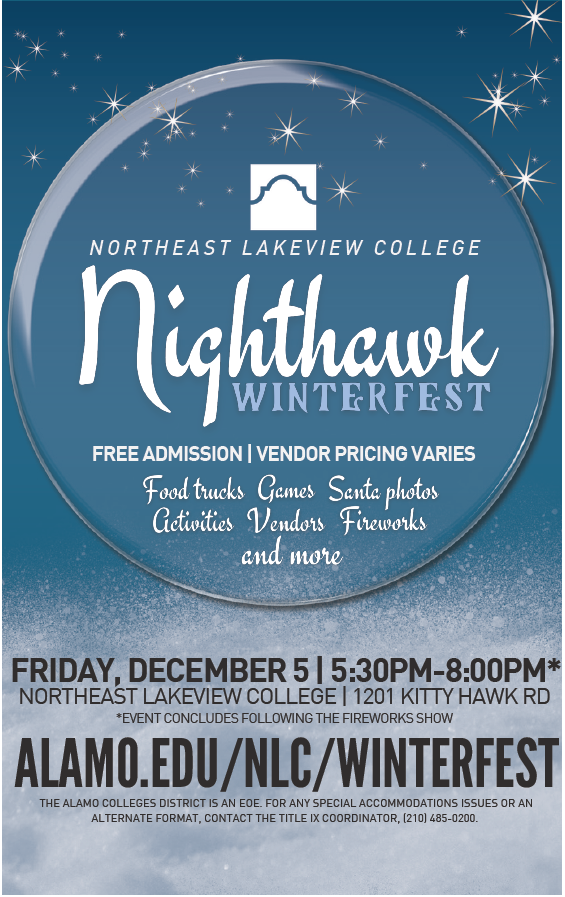

# Current Assignments

<table>
  <tr>
    <th align="center">Assigned</th>
    <th align="center">Cutoff</th>
    <th align="center">Description</th>
    <th align="center">Category</th>
  </tr>

  <!-- 
  <tr>
    <td align="left">January 1, 2026</td>
    <td align="left"><a href="url">Description</a></td>
    <td align="left">Daily</td>
  </tr>
   -->

  <tr>
    <td align="left">January 6, 2026</td>
    <td align="left">January 16, 2026</td>
    <td align="left"><a href="https://github.com/mswhitby/classroom/blob/main/_docs/classes/4th.md#january-6-2026">Journal - Welcome Back</a></td>
    <td align="left">Daily</td>
  </tr>

  <tr>
    <td align="left">January 9, 2026</td>
    <td align="left">January 16, 2026</td>
    <td align="left"><a href="https://github.com/mswhitby/classroom/blob/main/_docs/classes/4th.md#1-classroom-responsibility-essay">Classroom Responsibility Essay</a></td>
    <td align="left">Test</td>
  </tr>

  <tr>
    <td align="left">January 12, 2026</td>
    <td align="left">January 16, 2026</td>
    <td align="left"><a href="https://github.com/mswhitby/classroom/blob/main/_docs/classes/4th.md#january-12-2026">Journal - Developing Safe Spaces Online</a></td>
    <td align="left">Daily</td>
  </tr>

</table>

> [!IMPORTANT]
> Please reference the [Late Work Policy](https://github.com/mswhitby/classroom/blob/main/_docs/resources/late_work.md) for more information on cutoff dates. Assignments will not be accepted after the cutoff date. 

****

# January 12, 2026

## Agenda

### 1. Journal Entry: Developing Safe Spaces Online

In the early days of online gaming, many spaces were not designed to support everyone equally. Some players—especially neurodivergent players—experienced bullying, harassment, or exclusion simply for being different.

One example is [Autcraft](https://www.autcraft.com/). Autcraft was created as a private Minecraft server specifically designed to be a **safe, moderated, and welcoming online space** for autistic children and their families. It uses clear rules, active moderation, and a strong community culture to protect players and help them feel comfortable being themselves online.

#### Prompt

**Why was Autcraft created, and what problem was it solving?**

Explain **why safe spaces are needed on the internet**, especially in online games and social platforms. Then explain **why developers have a responsibility to design and protect these spaces**, instead of leaving safety up to users alone.

In your response, consider:

- What kinds of harm can happen in unmoderated online spaces?
- How Autcraft’s design choices help protect its community
- How developers’ choices (rules, moderation tools, reporting systems) affect user experience
- What could happen if developers ignore safety and inclusion
- Do you know of any other examples of safe, inclusive online spaces?

Write 5–7 complete sentences.

----

# January 9, 2026

## Agenda

### 1. Classroom Responsibility Essay

> [!IMPORTANT]
> **This is a <ins>TEST</ins> grade**

#### Directions:

You will write a **handwritten essay** on paper using the **C.E.R. (Claim, Evidence, Reasoning**) format. This assignment must be **turned in on paper**. Write your **full name and class period** on your completed paper.

#### Essay Prompt:

In our classroom, students are expected to **not eat or drink at the computers** and to **pick up their trash and clean up after themselves**. 

**Write an essay explaining why these expectations exist and why they matter.** Your essay should explain how these rules protect our learning environment, our technology, and the people who use the room. In your response, think about:

- How food and drinks can affect computers and technology
- How trash and messes affect the classroom environment
- How our choices impact other students and the teacher
- What kind of classroom we want to learn in

#### Required Structure (C.E.R.)

**Claim**

- Clearly state your position on **why we don’t eat or drink at computers and why we clean up after ourselves**.
- Your claim should be 1–2 sentences and directly answer the prompt.

**Example starter (do NOT copy)**:
 > “The rules about not eating at computers and cleaning up after ourselves are important because…”

**Evidence**
- Provide **specific examples** that support your claim.
- Evidence may include:
    - What can happen to computers when food or drinks are nearby
    - How trash affects the classroom, pests, or cleanliness
    - Real situations you’ve seen or could realistically happen in school
- Include at least **2 pieces of evidence**.

**Reasoning**

- Explain **how and why** your evidence supports your claim.
- Connect your examples to:
    - Responsibility
    - Respect for shared spaces
    - Preparation for real-world environments (college, jobs, workplaces)

#### Essay Requirements

- **Minimum**: 3 paragraphs (Claim, Evidence, Reasoning)
- **Length**: At least 1 page
- **Format**: Handwritten, complete sentences
- **Tone**: School-appropriate and thoughtful
- **Submission**: Paper only. Write yore name and class period.

#### Closing Reminder to Students:

This isn’t about punishment. It’s about understanding respect, responsibility, and shared space—skills you’ll need in school, work, and life. These classroom rules reflect how people are expected to treat shared spaces and expensive equipment in the real world.

----

# January 6, 2026

## Agenda

### 1. Journal Prompt

Welcome back! I hope you enjoyed your winter break! 

Write a paragraph describing how you used technology over the break. 

----

# December 15, 2025

## Agenda

### 1. Journal Prompt

What are your plans for the Winter Break?

----

# December 8, 2025

## Agenda

### 1. Weekly Journal Prompt: Waymo Cars & School Bus Safety

In Austin, self-driving Waymo cars have been caught on video illegally driving past stopped school buses—even when the red lights were flashing and the stop arm was out. The Austin school district reported at least 19–20 violations, and the federal government (NHTSA) has opened an investigation. Waymo says a software issue contributed to the problem, but the incidents continued even after software updates.

**Write 5 to 7 sentences responding to the following:**

Why do you think a self-driving car might fail to recognize or correctly respond to a stopped school bus with its stop sign extended? What challenges might the car’s cameras, sensors, or AI face in this situation? If you were a programmer on the Waymo team, what safety improvements would you add to make sure autonomous vehicles always stop for school buses? Describe at least one fix involving sensors, software rules, or emergency-stop logic.

### 2. Missing Work

If you complete any missing work, you must email me at <dwhitby@judsonisd.org> to let me know. If you do not email me, I will not know you've made up work and your make-up work will not be graded.

----

# December 1, 2025

**Welcome Back! Hope you enjoyed your break!**

## Agenda

### 1. Journal: Drones & Tech Careers

#### Instructions:

- Keep your writing clear (5–7 sentences).
- Use one real fact (salary, requirement, or example) from your search and include where you found it.

#### Prompt: 

Drones are becoming a major part of everyday life — from Amazon’s new drone deliveries in San Antonio to drone light shows at theme parks like Fiesta Texas. Companies use drones for photography, inspections, emergency response, mapping, and even agriculture.

Write a short response considering the following:
- One real job that uses drones (examples: delivery drone operator, drone programmer, drone show technician, drone mapper, agricultural drone pilot).
- What programmers do in that job — how does coding or software help drones fly, navigate, or do their tasks?
- What the pay looks like for that job in Texas or the U.S. (you can search “salary for ___ job Texas”).
- What education or certifications are normally required (ex: Part 107 license, computer science experience, programming, engineering, etc.).
- Would YOU want to do this job in the future? Why or why not?

----


# November 17, 2025

## Agenda

### 1. Journal

Are you looking forward to Thanksgiving break?

----

# November 13, 2025

<!--  -->


----

# November 10, 2025

## Agenda

### 1. Journal

#### Option 1: Technology & the Holidays

The holidays often bring new gadgets, apps, and games. Write a journal entry (5–7 sentences) using Claim, Evidence, and Reasoning (C.E.R.) considering the following:

- How has technology changed the way people celebrate or connect during the holidays?
- Do you think these changes make the holidays better or worse?
- Should developers be responsible for making sure holiday tech (like toys or assistants) respects privacy and family time? Why or why not?

#### Option 2: Gratitude & Growth

The end of the year is a time to reflect on what you’ve learned. What skills, habits, or moments from this semester that you’re most proud of, and how will you use it to grow next year? Write 5-7 sentences explaining your answer.

----

# November 3, 2025

## Agenda

### 1. Journal: Technology and Food Access

Over the weekend, the SNAP program (Supplemental Nutrition Assistance Program) ran out of funding. SNAP helps millions of families buy groceries each month, so when funding runs out, many people struggle to afford healthy food.

Technology has already made a big difference in other areas—like online shopping, delivery apps, and community alerts. Could it also help people find or access food when programs like SNAP are disrupted?

For your journal entry, write 5-7 sentences answering these questions:

- **1. What’s the problem?**

    Why is it a big deal if SNAP runs out of funding? Who might be most affected?

- **2. How could technology help?**

    Think about how apps, websites, or other tech tools could connect people to local food banks, free meal programs, or grocery stores.

- **3. What challenges might exist?**

    What makes it hard for everyone to use tech-based solutions? (For example: no internet, no smartphone, privacy concerns.)

- **4. If you were the designer…**

    Imagine you were creating a tool to help solve food insecurity. What would your idea be called, and what would it do?

----


# October 27, 2025

## Agenda

### 1. Journal: Choose One of The Following

#### Option 1: Technology & Natural Disasters

Hurricane Melissa is approaching Jamaica right now, and people are using technology to stay safe and informed. Think about how technology helps us prepare for natural disasters like hurricanes, floods, or wildfires.

In your journal, answer the following:

- What are some examples of technology that help people before, during, or after a natural disaster?
- How do those tools make a difference in saving lives or keeping people informed?
- If you could invent a new piece of technology to help in the future, what would it do and why?

Write at least one full paragraph (5–7 sentences) explaining your ideas. Be sure to give real examples and describe how your invention could work.

#### Option 2: Cooking Class Logic Puzzle

- [Cooking Class Logic Puzzle](https://daydreampuzzles.com/logic-puzzles/cooking-class/)
- Complete the puzzle, and submit the answer as a [Markdown Table](https://www.markdownguide.org/extended-syntax/#tables) in your journal

Example:

| Name     | Main Dish | Dessert |
| :------- | :-------- | :------ |
| Fiona    |           |         |
| Tobias   |           |         |
| Leanne   |           |         |

----

# October 20, 2025

## Agenda

### 1. Journal: Bungle On Board Logic Puzzle

- [Bungle On Board Logic Puzzle](https://daydreampuzzles.com/logic-puzzles/bungle-on-board/)
- Complete the puzzle, and submit the answer as a [Markdown Table](https://www.markdownguide.org/extended-syntax/#tables) in your journal

Example:

| Name     | Class | Seat |
| :------- | :---- | :--- |
| Franklin |       |      |
| Hardeep  |       |      |
| Marla    |       |      |

----

# October 14, 2025

## Journal Entry - Prompt Engineering with Canva AI

AI tools like Canva AI can help people design lessons, games, and creative projects — but only if they are given clear and detailed instructions. This skill is called prompt engineering.

According to [CompTIA’s 2025 Workforce and Learning Trends report](https://www.comptia.org/en-us/resources/research/workforce-and-learning-trends-2025), AI skills are now a top workforce priority. And recent [industry research](https://www.yochana.com/2025-prompt-engineering-salary-landscape/) shows that prompt engineers today can earn between $63,000 and over $270,000 annually, depending on experience and role.  That means being good at writing prompts isn’t just creative — it can be financially worthwhile and useful in many tech-related jobs.

Today, you’ll act like a teacher or professional and create a Canva AI prompt that teaches something academic and includes interactive elements. You can check out my example [here](https://final-projectangel.my.canva.site/prompts).

## Part 1: Your Prompt

Choose a topic from any subject (science, math, history, English, or computer science).

Examples:
- “Create an interactive slide deck that explains the water cycle to 5th graders.”
- “Make a quiz that helps students practice variables in Python.”
- “Design a choose-your-own-path story about the Civil Rights Movement.”

Write a detailed Canva AI prompt that tells it exactly what to make. 

Include:
- What the topic is
- Who it’s for (younger students, classmates, etc.)
- What you want it to build (slide deck, quiz, story, poster, or game)
- How it should look or sound (fun, professional, colorful, etc.)

Generate your design in Canva AI, publish your site, and share the link in your journal.

### Part 2: Your Reflection

In 5–7 sentences, explain:
- What your prompt was designed to do
- How Canva AI understood or built your idea
- What parts worked well
- What parts didn’t come out as expected
- How you could improve your prompt to get a better design next time
- Why being good at prompt engineering could be valuable in future careers

----

<!-- # October 14, 2025

## Agenda

### Journal Prompt: Prompt Engineering with Canva AI

Tools like Canva AI can generate interactive lessons, presentations, and designs when given clear, detailed instructions — called prompts. Your challenge today is to act as a teacher, trainer, or professional using AI to teach or demonstrate something academic.

Use Canva AI to create an interactive project that teaches a topic or concept. Your project could be:
- An interactive slide deck or mini-lesson (e.g., explaining variables in Python or the water cycle)
- A clickable quiz or review activity
- A choose-your-own-path story related to a subject
- A digital poster or infographic with clickable or animated elements
- A short educational game or simulation

#### Part 1: Your Prompt

Write a detailed prompt for Canva AI that tells it exactly what to make. Include:

- The topic or subject
- The goal (what learners should understand or do)
- The tone and audience (who it’s for)
- The interactive elements (clicks, animations, paths, or quizzes)

Then, generate your Canva design and share the link in your journal entry.


#### Part 2: Your Reflection

In 5–7 sentences, explain:

- What your prompt was designed to do
- How Canva interpreted it
- Which interactive parts worked best
- How you could improve your prompt or design next time

---- -->

# October 6, 2025

## Agenda

### Journal Entry

If you were in charge of your school, what would your technology and AI policy be? Think about things like cell phones, Chromebooks, AI tools (like ChatGPT), and online games. Should games be blocked, or should certain ones (like math or learning games) be allowed? In 5–7 sentences, explain your rules and why you think they would make school better.

----


# September 30, 2025

## Agenda

### 1. Journal Entry

Students often say the phrase "6, 7" during the day, but its meaning is unclear. Your challenge is to explain this phrase in your own words. **Write exactly 67 words, spread across six or seven sentences.** Consider how students use it in class or in the halls. Think about the mood or tone when it's spoken. Be creative, but also give your best explanation of why people keep repeating it.

### 2. Missing Work

I will be out next week, so the last day to submit missing work will be **Friday, October 3, 2025**. If you complete any missing work, you must email me at <dwhitby@judsonisd.org> to let me know. If you do not email me, I will not know you've made up work and your make-up work will not be graded. Below is a list of assignments that should be completed:

#### Journals

- [September 2, 2025](https://github.com/mswhitby/WHSTechNotes/blob/main/journal.md#september-2-2025)
- [September 8, 2025](https://github.com/mswhitby/WHSTechNotes/blob/main/journal.md#september-8-2025)
- [September 16, 2025](https://github.com/mswhitby/WHSTechNotes/blob/main/journal.md#september-16-2025)
- [September 22, 2025](https://github.com/mswhitby/WHSTechNotes/blob/main/journal.md#september-22-2025)
- [September 30, 2025](https://github.com/mswhitby/WHSTechNotes/blob/main/journal.md#september-30-2025)

----

# September 22, 2025

## Agenda

IKEA is experimenting with a virtual store inside Roblox, where people can actually earn $16.10 per hour to do jobs like restocking shelves, serving food, and helping customers—just like in a real store. You can read more here: [IKEA is opening a new store on Roblox… and you could be paid to work there!
](https://www.ikea.com/gb/en/newsroom/corporate-news/ikea-is-opening-a-new-store-on-roblox-pub8a9272d0/).

Write a journal entry (5–7 sentences) using Claim, Evidence, and Reasoning (C.E.R.) to respond to this question:

Do you think working in a virtual store for real money is a good idea or a bad idea for the future of jobs? Why?

- Claim: State your opinion clearly.
- Evidence: Use the IKEA example or your own ideas about gaming, work, or technology.
- Reasoning: Explain why your evidence supports your claim.

You may choose to complete the Beat the AI Challenge. For this option, you can use AI tools to help write your response. To receive credit, you must clearly mark at the bottom of your journal: “This response used AI.” Your challenge is to edit and improve the AI’s draft so it sounds more like you and less like a machine.

----

# September 15, 2025

## Agenda

### Journal Entry

This year, the White House launched the Presidential AI Challenge. The goal is to find creative ways for students, teachers, and communities to use Artificial Intelligence (AI) to solve real-world problems. The prize for winning teams is $10,000 per team member. You can learn more about the challenge here: [Presidential AI Challenge](https://www.ai.gov/initiatives/presidential-challenge).

Projects should:
- Use AI responsibly and ethically.
- Help people in education, health, safety, or the community.
- Be creative and realistic enough to try out.

#### Prompt

For today’s journal, write 5–7 complete sentences using the C.E.R. format:
- Claim: State your idea for an AI project.
- Evidence: Explain how your idea meets the challenge requirements.
- Reasoning: Show why your idea would be useful and how it would help people.

If you’re interested in actually submitting an idea for the challenge, you can fill out this form: [Presidential AI Challenge - Participation](https://docs.google.com/forms/d/e/1FAIpQLSdvV8FUN04EWx1Bzgj5cn3DWv-7IVqJvd6caPytAGFTNLrkew/viewform?usp=header).

----

# September 8, 2025

## Journal Entry

- Watch this video titled [“Computer Science is Changing Everything”](https://www.youtube-nocookie.com/embed/QvyTEx1wyOY?playlist=QvyTEx1wyOY&autoplay=1&iv_load_policy=3&loop=1&start=).
- In your GitHub journal, respond to the prompt below.
- Write at least 5 complete sentences.
- Use the C.E.R. format (Claim, Evidence, Reasoning).

> [!IMPORTANT]  
> **Heading Reminder**  
> At the very top of your entry, include the date as a first-level heading in this exact format:
>
> ```markdown
> # September 8, 2025
>
> Write your entry here...
> ```

### Prompt

Think of a career you’re interested in (e.g., nursing, filmmaking, fashion design, engineering, sports). Describe how computer science could be valuable in that profession. Use an example from the video or one from your own life to support your claim.

----

# September 2, 2025

Complete the following assignment in your GitHub Journal. First, please check the screen to find your name and make sure that all columns are marked "TRUE." If any column reads "FALSE," I will not be able to see your journal, and you will not receive credit for this assignment. The instructions for setting up your journal can be found at [jisd.link/journal](https://github.com/mswhitby/classroom/blob/main/_docs/resources/journal_creation.md). Please let me know if you need any assistance.

## Journal Entry


> [!IMPORTANT]  
> **Heading Reminder**  
> At the very top of your entry, include the date as a first-level heading in this exact format:
>
> ```markdown
> # September 2, 2025
>
> Write your entry here...
> ```

### Prompt 

Choose **ONE** of the following prompts and write a well-developed paragraph (5–7 sentences). Use C.E.R. (Claim, Evidence, Reasoning):
- Claim – your main point or stance
- Evidence – examples, experiences, or details to support your claim
- Reasoning – explain why your evidence proves your claim

#### Option 1: The New Cell Phone Law

What are your thoughts on the new school cell phone law? How are you adjusting to it, and what challenges or benefits do you see for students and teachers?

#### Option 2: Vibe Coding with AI

“Vibe coding” means using AI tools (like ChatGPT or GitHub Copilot) to help write or explain code instead of doing it fully on your own. What do you think are the risks and benefits of this AI-assisted approach for students learning computer science?

#### Option 3: Computer Science Expectations

What did you think computer science was before starting this class? Has your view changed so far? What do you hope to get from this course?

----

# August 27, 2025

## Agenda

### 1. Computer Science Usernames Form

- Complete the form at [jisd.link/usernames](https://jisd.link/usernames)

### 2. Github Journal Setup

- Setup your class journal following the instructions  at [jisd.link/journal](https://github.com/mswhitby/classroom/blob/main/_docs/resources/journal_creation.md).

----
 