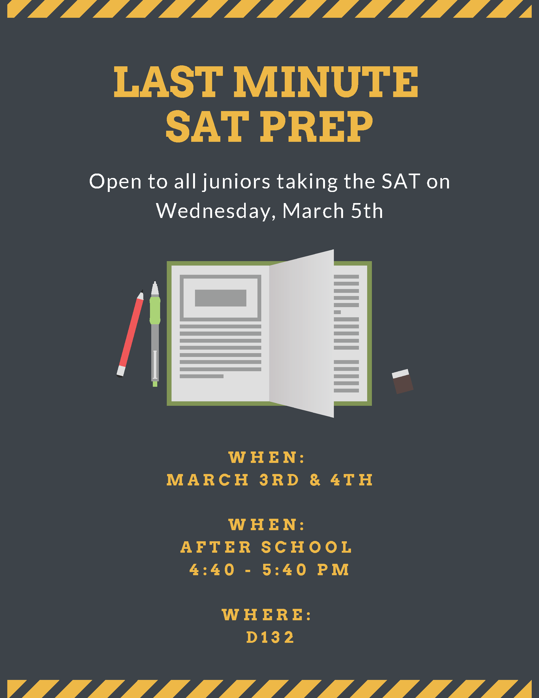
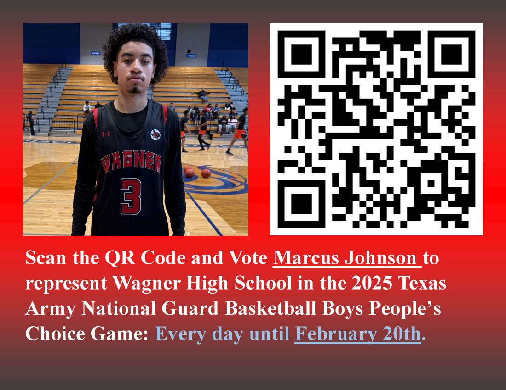

# May 5, 2025

<!-- ## Objective:

Students will analyze viral media trends and construct a C.E.R. argument evaluating the “100 Men vs Gorilla” challenge, considering logical reasoning and ethical implications.

## TEXS

<!-- Fundamentals of CS –  -->

<!-- §126.726(c)(4)(B): “Identify, describe, and apply principles of algorithmic thinking.” Students can reason through sequences of actions the 100 people could take, testing logic against real-world constraints. --> 

## Agenda

### 1. Journal: Gorilla vs 100 Men

A challenge called “100 Men vs 1 Gorilla” went viral after a famous YouTuber suggested testing it. The idea: could 100 unarmed people defeat a silverback gorilla? Some people say yes with strategy; others say it’s impossible. Write two paragraphs considering the following:

1. Do you think the 100 people could win? Why or why not? Use logic, facts, and your own reasoning.

2. Do you think it’s responsible to make this kind of challenge go viral? What might people learn from it—or misunderstand?

3. What does this say about how trends spread online? Is there a connection between entertainment and education?

Use the C.E.R. structure:

- Claim – What do you believe?
- Evidence – What facts or logic back you up?
- Reasoning – Why does this matter?

----

# April 28, 2025

## Agenda

### 1. Journal: Cake Maker Logic Puzzle

- Complete [Cake Maker Logic Puzzle](https://daydreampuzzles.com/logic-puzzles/cake-maker/), and submit the answer as a [Markdown Table](https://www.markdownguide.org/extended-syntax/#tables) in your journal.

**Example:**

| Name     | Flavor | Occasion | Price |
| :------- | :----- | :------- | :---- |
| Sally    |        |          |       | 
| Michael  |        |          |       | 
| Emma     |        |          |       | 

----

# April 22, 2025

## Objective

Student will be able to: 
- write a professional appreciation email given guidelines and a model example, and submit by BCC'ing the teacher
- demonstrate professional written communication by composing and sending an appreciation email to a campus staff member, following formal email conventions.

## TEKS 

<!-- ### Fundamentals of Computer Science – TEKS 126.32: -->

<!-- - **126.32(4)(D)** Demonstrate proficiency in personal digital communication.  

- **126.32(4)(E)** Demonstrate ethical use of digital communication and media. -->

<!-- ### Computer Science I – TEKS 126.33: -->
<!-- 
- **(3)(A)** Demonstrate professional and responsible use of communication tools.  

- **(3)(C)** Use email and other digital tools appropriately in a professional setting. -->

<!-- ### Game Programming & App Dev – TEKS 126.38 / 126.39: -->

- **126.38(3)(C)** Demonstrate appropriate use of communication tools.  

- **126.39(3)(E)** Apply effective communication skills using technical writing and documentation.

## Agenda 

### 1. Journal Prompt: Write a Professional Appreciation Email

Write a professional appreciation email to any staff member on campus who has made a positive impact on you. This can be a teacher, counselor, coach, custodian, cafeteria worker, or anyone else you want to thank (anyone other than your Computer Science teacher). The email must follow formal email conventions.

#### Your email must include:
1. A respectful greeting  
2. A clear reason why you’re writing (to show appreciation)  
3. Specific examples of what the staff member has done  
4. A positive, professional tone  
5. A proper closing  

#### Peer Review:
Before sending your email, ask a classmate to read it and give you feedback. A second pair of eyes can help you catch spelling, grammar, or tone issues you might miss. Be sure to return the favor and review a peer’s email, too! I have a checklist for you to use for peer review.

#### How to Submit:
- Send your email to the staff member from your school account.
- **BCC** me at dwhitby@judsonisd.org so I know you completed the assignment.

#### Model Email Example

> **Subject:** Thank You for Your Support and Accountability

> Dear Coach Starin,
> 
> I wanted to take a moment to thank you for everything you do to help students stay focused on work ethic, respect, and responsibility. Your expectations are clear and consistent, and even when we don’t always get it right, you still push us to do better. I’ve noticed that students in your presence tend to carry themselves with more maturity, and that’s a reflection of your leadership.
>
> Thank you for being a positive influence on our campus and for holding us to a high standard. It really does make a difference.
>  
>  
> Best regards,  
> Ms. Whitby

### 2. Testing Room Assignments

Visit [jisd.link/whs-testing](http://jisd.link/whs-testing) or scan for testing room assignments:

----

# April 14, 2025

### 1. Journal Prompt: High School Cell Phone & Social Media Bans

Florida has enacted laws banning student cell phone use throughout the school day and restricting access to social media on school networks. Supporters argue these measures reduce distractions and cyberbullying, while opponents raise concerns about emergency communication and student autonomy. Read about Florida’s new legislation banning student cell phone use during the entire school day and restricting access to social media on school Wi-Fi:

- [What you need to know about Florida's classroom cellphone bans and a new social media law](https://www.wusf.org/politics-issues/2025-01-13/what-to-know-florida-classroom-cellphone-bans-new-social-media-law)

- [Judge weighs whether to block Florida’s social media ban for minors](https://apnews.com/article/florida-social-media-ban-minors-lawsuit-92ddc72484a5164e8fdb98062e1be543)

Write **TWO** paragraphs considering the following:

- Do you believe such bans are beneficial or detrimental to students?
- How might these policies influence student behavior, safety, and learning?
- If implemented in your school, how would you respond to such restrictions? 

----

# April 7, 2025

## Objective

Students will be able to explain how artificial intelligence can support their learning by analyzing a real-world example of AI improving test scores in a Texas school.

## TEKS

- §126.32(c)(1)(B) - extend the learning environment beyond the school walls with digital products created to increase teaching and learning in the other subject areas
- §126.32(c)(1)(E) - create web pages using a mark-up language

## Agenda

### 1. Journal Prompt: AI & Test Prep

Write two paragraphs considering the following:

Recently, a [school in Austin, Texas used AI tutors to help students prepare for tests](https://www.fox7austin.com/news/alpha-school-two-hour-learning-ai-tutor-austin-texas)—and it worked. Their scores improved so much that they ranked in the top 2% nationally. With STAAR testing happening this week, think about how AI tools (like ChatGPT, Khanmigo, or other learning apps) could help you perform better.

How do you think AI can help you study, prepare, or stay organized for tests like the STAAR? What would be the most useful feature of an AI tutor for you personally? Be honest—do you think you’d use it? Why or why not?

----

# April 4, 2025

## Game Program & Design 

### Objective

Students will be able to:
- Interpret basic code in a Unity code base
- Improve simple code using the features of an IDE
- Control the execution of code with common logic structures

### TEKS:

- §126.57(c)(4)(A) – Use an IDE to write and debug programs.
- §126.57(c)(4)(B) – Use proper syntax and language structure in developing code.
- §126.57(c)(4)(C) – Implement conditional statements and logic structures.
- §126.57(c)(5)(C) – Develop game solutions using structured programming techniques.

### Agenda

#### 1. [Unity Junior Programmer: Basic Gameplay](https://learn.unity.com/pathway/junior-programmer/unit/basic-gameplay)

- [Tutorial Unit 2 - Introduction](https://learn.unity.com/pathway/junior-programmer/unit/basic-gameplay/tutorial/6759d4deedbc2a19d88974c3?version=6)
    - [Lesson 2.1 - Player Positioning](https://learn.unity.com/pathway/junior-programmer/unit/basic-gameplay/tutorial/lesson-2-1-player-positioning?version=6)
    - [Lesson 2.2 - Food Flight](https://learn.unity.com/pathway/junior-programmer/unit/basic-gameplay/tutorial/lesson-2-2-food-flight?version=6)

## Mobile App Development

### Objective

Students will be able to:
- Apply formatting tags in order to modify the appearance of text and make web pages look clear and aesthetically pleasing

### TEKS:

- §126.61(c)(5)(A) – Identify and use appropriate tags to create web pages.
- §126.61(c)(5)(B) – Format text and layout using HTML and CSS to enhance appearance and usability.
- §126.61(c)(5)(C) – Apply web design principles to enhance user experience and aesthetics.

### Agenda

#### 1. CodeHS - Texas Web Design Unit 5 - Web Development
- 5.3.1 Formatting Text
- 5.3.2 Formatting Text Quiz
- 5.3.3 Dictionary
- 5.3.4 That's Bold
- 5.3.5 Artificial Intelligence
- 5.3.6 State Capitals

----

# April 3, 2025

## Game Program & Design 

### Objective

Students will be able to:
- Interpret basic code in a Unity code base
- Improve simple code using the features of an IDE
- Control the execution of code with common logic structures

### TEKS:

- §126.57(c)(4)(A) – Use an IDE to write and debug programs.
- §126.57(c)(4)(B) – Use proper syntax and language structure in developing code.
- §126.57(c)(4)(C) – Implement conditional statements and logic structures.
- §126.57(c)(5)(C) – Develop game solutions using structured programming techniques.

### Agenda

#### 1. [Unity Junior Programmer: Basic Gameplay](https://learn.unity.com/pathway/junior-programmer/unit/basic-gameplay)

- [Tutorial Unit 2 - Introduction](https://learn.unity.com/pathway/junior-programmer/unit/basic-gameplay/tutorial/6759d4deedbc2a19d88974c3?version=6)
    - [Lesson 2.1 - Player Positioning](https://learn.unity.com/pathway/junior-programmer/unit/basic-gameplay/tutorial/lesson-2-1-player-positioning?version=6)
    - [Lesson 2.2 - Food Flight](https://learn.unity.com/pathway/junior-programmer/unit/basic-gameplay/tutorial/lesson-2-2-food-flight?version=6)

## Mobile App Development

### Objective

Students will be able to:
- Apply formatting tags in order to modify the appearance of text and make web pages look clear and aesthetically pleasing

### TEKS:

- §126.61(c)(5)(A) – Identify and use appropriate tags to create web pages.
- §126.61(c)(5)(B) – Format text and layout using HTML and CSS to enhance appearance and usability.
- §126.61(c)(5)(C) – Apply web design principles to enhance user experience and aesthetics.

### Agenda

#### 1. CodeHS - Texas Web Design Unit 5 - Web Development
- 5.3.1 Formatting Text
- 5.3.2 Formatting Text Quiz
- 5.3.3 Dictionary
- 5.3.4 That's Bold
- 5.3.5 Artificial Intelligence
- 5.3.6 State Capitals

----

# March 31, 2025

## Objective

Students will be able to:

- assess their mental wellness and develop personal strategies for academic and emotional resilience using a journal prompt shared through GitHub.
- reflect on their well-being and establish a realistic goal for the last 9 weeks through a wellness check-in journal entry.

## TEKS:

- §126.50(c)(2)(F) – Demonstrate personal responsibility, integrity, and ethical behavior
- §126.50(c)(4)(C) – Reflect on personal learning and set goals for improvement.
- §126.52(c)(3)(D) – Demonstrate self-monitoring and goal setting as a lifelong learning skill.

## Agenda

### 1. Weekly Journal Prompt: Wellness & Mindset Check

> [!IMPORTANT]
> 
> Your journal is public on GitHub. If you want to share something personal or private, please email me or talk to me in person instead of posting it in your journal. I’m here for you and want to support you in any way I can.

As we enter the final stretch of the school year and prepare for STAAR testing, it’s normal to feel a mix of emotions—stress, excitement, pressure, even exhaustion. This week’s journal is all about checking in with you.

Write about the following:

1. How are you feeling right now—mentally, emotionally, and physically?

2. What’s been the most stressful part of school lately?

3. What are some things you do (or could do) to take care of yourself during stressful times?

4. What’s one goal you have for the rest of the school year? How will you stay motivated to reach it?

5. Who is someone you can talk to when you’re feeling overwhelmed? Why do you trust them?

You don’t have to have all the answers—just be honest. This is your space.

----

# March 25, 2025

## Game Program & Design 

### Objective

Students will be able to:
- Interpret basic code in a Unity code base
- Improve simple code using the features of an IDE
- Control the execution of code with common logic structures

### TEKS:

- §126.57(c)(4)(A) – Use an IDE to write and debug programs.
- §126.57(c)(4)(B) – Use proper syntax and language structure in developing code.
- §126.57(c)(4)(C) – Implement conditional statements and logic structures.
- §126.57(c)(5)(C) – Develop game solutions using structured programming techniques.

### Agenda

#### 1. [Unity Junior Programmer: Basic Gameplay](https://learn.unity.com/pathway/junior-programmer/unit/basic-gameplay)

- [Tutorial Unit 2 - Introduction](https://learn.unity.com/pathway/junior-programmer/unit/basic-gameplay/tutorial/6759d4deedbc2a19d88974c3?version=6)
    - [Lesson 2.1 - Player Positioning](https://learn.unity.com/pathway/junior-programmer/unit/basic-gameplay/tutorial/lesson-2-1-player-positioning?version=6)
    - [Lesson 2.2 - Food Flight](https://learn.unity.com/pathway/junior-programmer/unit/basic-gameplay/tutorial/lesson-2-2-food-flight?version=6)

## Mobile App Development

### Objective

Students will be able to:
- Apply formatting tags in order to modify the appearance of text and make web pages look clear and aesthetically pleasing

### TEKS:

- §126.61(c)(5)(A) – Identify and use appropriate tags to create web pages.
- §126.61(c)(5)(B) – Format text and layout using HTML and CSS to enhance appearance and usability.
- §126.61(c)(5)(C) – Apply web design principles to enhance user experience and aesthetics.

### Agenda

#### 1. CodeHS - Texas Web Design Unit 5 - Web Development
- 5.3.1 Formatting Text
- 5.3.2 Formatting Text Quiz
- 5.3.3 Dictionary
- 5.3.4 That's Bold
- 5.3.5 Artificial Intelligence
- 5.3.6 State Capitals

----

# March 24, 2025

## Objective

Students will reflect on the role of technology in modern sports by responding to a journal prompt about March Madness innovations using evidence and reasoning.

## TEKS:

<!-- Update TEKS -->

- §126.47(c)(4): The student uses critical thinking, problem solving, and decision-making to make informed decisions.
- §126.47(c)(6): The student demonstrates knowledge and appropriate use of technology systems, concepts, and operations.

## Agenda

### 1. Journal Prompt: Technology and March Madness

Write two paragraphs considering the following: 

“March Madness, the annual NCAA basketball tournament, has increasingly integrated advanced technologies to enhance both gameplay and the fan experience. From the use of artificial intelligence (AI) in predicting game outcomes to the implementation of augmented reality (AR) in broadcasting, technology is reshaping how we engage with sports. Reflect on how these technological advancements have influenced your perception of the tournament. Do you believe AI-driven predictions, such as those attempting to create perfect brackets, add excitement or detract from the unpredictability that makes March Madness thrilling? Additionally, consider the role of social media platforms and streaming services in transforming fan engagement during the tournament. How do these changes impact the traditional viewing experience and your connection to the games?” 

----

# March 20, 2025

## Agenda

### 1. Unity Test: Unit 1 - Player Control

- Your test is on Canvas. 
- You're only allowed 1 attempt. I suggest you first complete the Unity Module before attempting the test on Canvas. 

### 2. Journal

- Complete your journal entry for this week if you have not completed it yet.
- The journal entry was [March 17, 2025](https://github.com/mswhitby/classroom/blob/main/_docs/resources/journal.md#march-17-2025).
- You must email me to let me know you've submitted your journal late. If you do not email me, your journal entry may not be graded.

### 3. Grades

- **Friday, March 21st** is the end of the grading period—which means all missing assignments must be submitted by this date in order for you to receive credit.
- There are over 30 journal entries that I cannot grade because the headings are not properly formatted. Check Skyward to make sure you have a grade for all journals you've completed. Also, check your journal to make sure you've written your dates correctly.
- You must email me if you complete any missing work. I will not know you've turned in late work if you do not send me an email informing me.

----

# March 19, 2025

## Agenda

### 1. Unity Test: Unit 1 - Player Control

- Your test is on Canvas. 
- You're only allowed 1 attempt. I suggest you first complete the Unity Module before attempting the test on Canvas. 

### 2. Journal

- Complete your journal entry for this week if you have not completed it yet.
- The journal entry was [March 17, 2025](https://github.com/mswhitby/classroom/blob/main/_docs/resources/journal.md#march-17-2025).
- You must email me to let me know you've submitted your journal late. If you do not email me, your journal entry may not be graded.

### 3. Grades

- **Friday, March 21st** is the end of the grading period—which means all missing assignments must be submitted by this date in order for you to receive credit.
- There are over 30 journal entries that I cannot grade because the headings are not properly formatted. Check Skyward to make sure you have a grade for all journals you've completed. Also, check your journal to make sure you've written your dates correctly.
- You must email me if you complete any missing work. I will not know you've turned in late work if you do not send me an email informing me.

----

# March 17, 2025

## Agenda

### 1. Journal Prompt: Technology Over Spring Break

Over spring break, you likely used technology in different ways—whether for entertainment, communication, creativity, or learning. Reflect on how you interacted with technology during your time off.

 - What types of technology did you use most often? (Examples: apps, games, programming tools, robotics, social media, etc.)
 - How did this technology help you, entertain you, or challenge you in some way?
 - Can you connect any of your technology use to what we learn in this class? Think about problem-solving, coding, game development, app functionality, or other related skills.

Write **at least two full paragraphs** responding to these questions. Be specific in your examples and connections.

### 2. Grades

- **Friday, March 21st** is the end of the grading period—which means all missing assignments must be submitted by this date in order for you to receive credit.
- There are over 30 journal entries that I cannot grade because the headings are not properly formatted. Check Skyward to make sure you have a grade for all journals you've completed. Also, check your journal to make sure you've written your dates correctly.
- You must email me if you complete any missing work. I will not know you've turned in late work if you do not send me an email informing me.

----

# March 3, 2025

## Agenda

### 1. Journal: Heroes Underground Logic Puzzle

- [Heroes Underground Logic Puzzle](https://daydreampuzzles.com/logic-puzzles/heroes-underground/)
- Complete the puzzle, and submit the answer as a [Markdown Table](https://www.markdownguide.org/extended-syntax/#tables) in your journal
- Example:

| Name    | Power | Challenge |
| :------ | :---- | :-------- |
| Zara    |       |           |
| Aether  |       |           |
| Thorne  |       |           |
| Silver  |       |           |
| Tangier |       |           |

<!-- ### 2. SAT Prep

Hello Juniors!

As you know, you will be taking the SAT on Wednesday. You don't need to do anything but show up on Wednesday and look for your testing room (rosters will be posted around campus on the morning of).

Ms. Whitby will be doing some last-minute test prep with students today and tomorrow after school from 4:40 - 5:40 PM. Her classroom is located in D132.

You can also find more test prep on our Google Site, [here](https://sites.google.com/judsonisd.org/whscollegecareer/home/test-prep).

 -->

----

# February 26, 2025

## Agenda

### All Students

#### 1. Journal

- Complete your journal entry for this week if you have not completed it yet.
- The journal entry was assigned Monday, February 3, 2025.

### Game Program & Design 

#### 1. [Unity Junior Programmer: Create with Code 1](https://learn.unity.com/mission/programming-basics?pathwayId=5f7e17e1edbc2a5ec21a20af)

- [Tutorial Unit 1 - Introduction](https://learn.unity.com/tutorial/unit-1-introduction?uv=2022.3&pathwayId=5f7e17e1edbc2a5ec21a20af&missionId=5f71fe63edbc2a00200e9de0&projectId=5caccdfbedbc2a3cef0efe63#)

    - [Challenge 1 - Plane Programming](https://learn.unity.com/tutorial/challenge-1-steer-a-plane-through-obstacles-in-the-sky?uv=2022.3&pathwayId=5f7e17e1edbc2a5ec21a20af&missionId=5f71fe63edbc2a00200e9de0&projectId=5caccdfbedbc2a3cef0efe63)

<!-- ### Objective

The student will usee the skills you learned in the driving simulation to fly a plane around obstacles in the sky.

### TEKS -->

----

# February 24, 2025

## Agenda

### 1. Journal Prompt

Language evolves rapidly, and slang plays a major role in how young people communicate. For teachers, counselors, social workers, and other professionals who work with youth, understanding slang can help build connections and improve communication. Consider the following:

- How can technology be used to help educators and service providers stay updated on evolving youth language?

- What are some potential benefits and challenges of integrating slang translation tools into educational apps, AI chatbots, or online resources?

- Should schools or youth organizations formally track and teach appropriate slang to improve communication, or is it best left informal?

- How might misunderstandings of slang impact interactions between adults and youth in schools, counseling, or mentoring programs?

Write two paragraphs exploring how technology could bridge generational language gaps while maintaining professionalism and cultural awareness.

----

# February 18, 2025

## Agenda

### 1. Journal Prompt

What's the most interesting thing you learned last week? It could be from this class, another subject, a conversation, a YouTube video, or even something you discovered on your own. Explain what it was, how you learned it, and why you found it interesting.

<!-- ### 2. Vote for Marcus Johnson! Only 2 Days Left!

Please click on the link or scan the QR code below to vote for Wagner's very own **Marcus Johnson** as the Army National Guard People's Choice Player for the Valero All Star basketball game!

[Vote Here!](https://woobox.com/hzdfnk)

 -->

----

# February 12, 2025

## Agenda

### All Students

#### 1. Journal

- Complete your journal entry for this week if you have not completed it yet.
- The journal entry was assigned Monday, February 3, 2025.

### Game Program & Design 

#### 1. [Unity Junior Programmer: Create with Code 1](https://learn.unity.com/mission/programming-basics?pathwayId=5f7e17e1edbc2a5ec21a20af)

- [Tutorial Unit 1 - Introduction](https://learn.unity.com/tutorial/unit-1-introduction?uv=2022.3&pathwayId=5f7e17e1edbc2a5ec21a20af&missionId=5f71fe63edbc2a00200e9de0&projectId=5caccdfbedbc2a3cef0efe63#)
    - [Lesson 1.4 - Step into the Driver's Seat](https://learn.unity.com/tutorial/lesson-1-4-use-user-input-to-control-the-vehicle?uv=2022.3&pathwayId=5f7e17e1edbc2a5ec21a20af&missionId=5f71fe63edbc2a00200e9de0&projectId=5caccdfbedbc2a3cef0efe63)
    - [Challenge 1 - Plane Programming](https://learn.unity.com/tutorial/challenge-1-steer-a-plane-through-obstacles-in-the-sky?uv=2022.3&pathwayId=5f7e17e1edbc2a5ec21a20af&missionId=5f71fe63edbc2a00200e9de0&projectId=5caccdfbedbc2a3cef0efe63)

<!-- ### Mobile App Development -->

<!-- ### Vote for Marcus Johnson!

Please click on the link or scan the QR code below to vote for Wagner's very own **Marcus Johnson** as the Army National Guard People's Choice Player for the Valero All Star basketball game!

[Vote Here!](https://woobox.com/hzdfnk)

 -->

----

# February 11, 2025

## Agenda

### 1. Journal - Student's Choice

For this week's journal you may choose either the logic puzzle or the writing prompt. You **do not** have to do both!

- If you choose the logic puzzle, submit the solution to the puzzle as a [Markdown Table](https://www.markdownguide.org/extended-syntax/#tables).
- If you choose the writing prompt, you response needs to be at least **TWO** paragraphs.

Writing Prompt

#### Prompt

The Super Bowl generates massive amounts of data, from player stats to real-time analytics used for coaching decisions. Many teams use **machine learning and AI** to analyze past performances and predict the best plays.

**Imagine you are a software developer working for an NFL team.** Your task is to design an application that helps coaches make better in-game decisions using real-time data. Write **TWO** paragraphs explaining your idea. If you're not sure where to start, consider the following:

1. What **features** would your application include?

2. What type of **data structures** (e.g., lists, dictionaries, databases) would you use to store player performance statistics?

3. How could **algorithms** (such as sorting, searching, or machine learning models) help analyze the data to improve decision-making?

4. If you were to visualize the data, what kind of **graphs or dashboards** would you create?

Be sure to explain your choices and how they would help a team gain a competitive advantage. You can also explore the NFL's [Next Gen Stats](https://nextgenstats.nfl.com/) page to see examples how the league uses data.

Logic Puzzle

#### Puzzle

- You can find the puzzle here: [Colors And Shapes Logic Puzzle](https://daydreampuzzles.com/logic-puzzles/colors-and-shapes/)
- Once you solve the puzzle, submit the solution in your journal as a [Markdown Table](https://www.markdownguide.org/extended-syntax/#tables).

| Shape    | Color | Count |
| -------- | ----- | ----- |
| Circle   |       |       |
| Square   |       |       |
| Hexagon  |       |       |
| Triangle |       |       |
| Octagon  |       |       |

<!-- ### 2. Vote for Marcus Johnson! Yes, Again!

Please click on the link or scan the QR code below to vote for Wagner's very own **Marcus Johnson** as the Army National Guard People's Choice Player for the Valero All Star basketball game!

[Vote Here!](https://woobox.com/hzdfnk)

 -->

----

# February 7, 2025

## Agenda

### All Students

#### 1. Journal

- Complete your journal entry for this week if you have not completed it yet.
- The journal entry was assigned Monday, February 3, 2025.

### Game Program & Design 

#### 1. [Unity Junior Programmer: Create with Code 1](https://learn.unity.com/mission/programming-basics?pathwayId=5f7e17e1edbc2a5ec21a20af)

- [Tutorial Unit 1 - Introduction](https://learn.unity.com/tutorial/unit-1-introduction?uv=2022.3&pathwayId=5f7e17e1edbc2a5ec21a20af&missionId=5f71fe63edbc2a00200e9de0&projectId=5caccdfbedbc2a3cef0efe63#)
- [Lesson 1.1 - Start your 3D Engines](https://learn.unity.com/tutorial/set-up-your-first-project-in-unity?uv=2022.3&pathwayId=5f7e17e1edbc2a5ec21a20af&missionId=5f71fe63edbc2a00200e9de0&projectId=5caccdfbedbc2a3cef0efe63#)
- [Lesson 1.2 - Pedal to the Metal](https://learn.unity.com/tutorial/1-2-move-the-vehicle-with-your-first-line-of-c?uv=2022.3&pathwayId=5f7e17e1edbc2a5ec21a20af&missionId=5f71fe63edbc2a00200e9de0&projectId=5caccdfbedbc2a3cef0efe63)
- [Lesson 1.3 - High Speed Chase](https://learn.unity.com/tutorial/1-3-make-the-camera-follow-the-vehicle-with-variables)

<!-- ### Mobile App Development -->

<!-- ### Vote for Marcus Johnson!

Please click on the link or scan the QR code below to vote for Wagner's very own **Marcus Johnson** as the Army National Guard People's Choice Player for the Valero All Star basketball game!

[Vote Here!](https://woobox.com/hzdfnk)

 -->

----

# February 6, 2025

## Agenda

### All Students

#### 1. Journal

- Complete your journal entry for this week if you have not completed it yet.
- The journal entry was assigned Monday, February 3, 2025.

### Game Program & Design 

#### 1. [Unity Junior Programmer: Create with Code 1](https://learn.unity.com/mission/programming-basics?pathwayId=5f7e17e1edbc2a5ec21a20af)

- [Tutorial Unit 1 - Introduction](https://learn.unity.com/tutorial/unit-1-introduction?uv=2022.3&pathwayId=5f7e17e1edbc2a5ec21a20af&missionId=5f71fe63edbc2a00200e9de0&projectId=5caccdfbedbc2a3cef0efe63#)
- [Lesson 1.1 - Start your 3D Engines](https://learn.unity.com/tutorial/set-up-your-first-project-in-unity?uv=2022.3&pathwayId=5f7e17e1edbc2a5ec21a20af&missionId=5f71fe63edbc2a00200e9de0&projectId=5caccdfbedbc2a3cef0efe63#)
- [Lesson 1.2 - Pedal to the Metal](https://learn.unity.com/tutorial/1-2-move-the-vehicle-with-your-first-line-of-c?uv=2022.3&pathwayId=5f7e17e1edbc2a5ec21a20af&missionId=5f71fe63edbc2a00200e9de0&projectId=5caccdfbedbc2a3cef0efe63)

<!-- ### Mobile App Development -->

<!-- ### Vote for Marcus Johnson!

Please click on the link or scan the QR code below to vote for Wagner's very own **Marcus Johnson** as the Army National Guard People's Choice Player for the Valero All Star basketball game!

[Vote Here!](https://woobox.com/hzdfnk)

 -->

----

# February 5, 2025

## Agenda

### All Students

#### 1. Late Work Policy

- Complete the **Late Work Policy** assignment on Canvas, acknowledging that you understand this policy will be enforced, effective today.

#### 2. Journal

- Complete your journal entry for this week if you have not completed it yet.
- The journal entry was assigned Monday, February 3, 2025.

### Game Program & Design 

#### 1. [Unity Junior Programmer: Create with Code 1](https://learn.unity.com/mission/programming-basics?pathwayId=5f7e17e1edbc2a5ec21a20af)

- [Tutorial Unit 1 - Introduction](https://learn.unity.com/tutorial/unit-1-introduction?uv=2022.3&pathwayId=5f7e17e1edbc2a5ec21a20af&missionId=5f71fe63edbc2a00200e9de0&projectId=5caccdfbedbc2a3cef0efe63#)
- [Lesson 1.1 - Start your 3D Engines](https://learn.unity.com/tutorial/set-up-your-first-project-in-unity?uv=2022.3&pathwayId=5f7e17e1edbc2a5ec21a20af&missionId=5f71fe63edbc2a00200e9de0&projectId=5caccdfbedbc2a3cef0efe63#)

<!-- ### Mobile App Development -->

<!-- ### Vote for Marcus Johnson!

Please click on the link or scan the QR code below to vote for Wagner's very own **Marcus Johnson** as the Army National Guard People's Choice Player for the Valero All Star basketball game!

[Vote Here!](https://woobox.com/hzdfnk)

 -->

----

# February 4, 2025

## Assignments

### Game Program & Design

**Junior Programmer:** [Junior Programmer: Create with Code 1](https://learn.unity.com/mission/programming-basics?pathwayId=5f7e17e1edbc2a5ec21a20af)

<!-- ### Mobile App Development -->

### 2. Journal

- Complete your journal entry for this week if you have not completed it yet.
- The journal entry was assigned Monday, February 3, 2025.
- At least 20 people spelled "February" incorrectly (I'm not sure who; I just know how many people). If you did not receive credit for your journal, please check your heading.
- You must email me to let me know you've submitted your journal late. If you do not email me, your journal entry may not be graded.

<!-- ### 3. Vote for Marcus Johnson!

Please click on the link or scan the QR code below to vote for Wagner's very own **Marcus Johnson** as the Army National Guard People's Choice Player for the Valero All Star basketball game!

[Vote Here!](https://woobox.com/hzdfnk)

 -->

----

# February 3, 2025

## Agenda

### 1. Journal 

On January 29, a tragic mid-air collision occurred over Washington, D.C., claiming the lives of 67 people, including military personnel and young athletes returning from a competition. While we mourn this loss, tragedies like this also push us to examine what went wrong and how we can prevent similar events in the future. In aviation, technology plays a crucial role in ensuring safety—yet when systems fail, the consequences can be devastating.

Technology is a key part of modern aviation, from air traffic control systems to automated flight assistance. However, even the most advanced systems can fail. Based on the recent mid-air collision over Washington, D.C., discuss how Computer Science contributes to aviation safety. Consider software development, automation, cybersecurity, or human-computer interaction. What improvements could be made to prevent accidents like this in the future?

**Possible Connections to Computer Science**

1.  **Air Traffic Control Systems** – How do computer algorithms manage airspace and prevent collisions?
2. **Automation & AI in Aviation** – The role of autopilot systems, real-time alerts, and AI-driven decision-making.
3. **Software Errors & Bugs** – How can coding flaws or miscommunication between different software systems contribute to accidents?
4. **Human-Computer Interaction (HCI)** – Did poor interface design or unclear alerts play a role in the crash?
5. **Cybersecurity in Aviation** – Could hacking, jamming, or cyber vulnerabilities pose risks in air traffic management?
6. **Big Data & Predictive Analytics** – How could machine learning be used to predict and prevent accidents?

Write two (2) paragraphs exploring how technology can integration can provided for increased aviation safety. You can use one or more of the six areas listed above, or you can choose another relevant topic of your interest. 

### 2. Vote for Marcus Johnson!

Please click on the link or scan the QR code below to vote for Wagner's very own **Marcus Johnson** as the Army National Guard People's Choice Player for the Valero All Star basketball game!

[Vote Here!](https://woobox.com/hzdfnk)

# January 27, 2025

## Agenda

### 1. Journal: Apprentice Mechanic Mishaps Logic Puzzle

Four apprentice mechanics work at Rusty's Repair Shop. They are generally well-regarded by management, but last week with less supervision there were some mistakes that led to a number of angry customers. Using the clues provided, can you determine which apprentice worked on which car, and the mistake that was made?

#### Clues

1. Bart didn't work on the Sierra, nor did he leave the oil cap off.
2. The four apprentices are Kayla, the one who worked on the Honda Civic, the one who left the oil cap off, and the one who left stains on the carpet.
3. The receptionist was in tears after dealing with the customer who had found a hole was accidentally drilled in their gas tank (oops!). This wasn't the Sierra.
4. Jimmy didn't leave the oil cap off nor leave stains on the carpet of the vehicle he worked on.
5. Harrison worked on the Forester, and disliked every minute of it.

#### Directions
- Complete the puzzle, and submit the answer as a [Markdown Table](https://www.markdownguide.org/extended-syntax/#tables) in your journal
- Example:

| Name     | Car | Mistake |
| :------- | :-- | :------ |
| Jimmy    |     |         |
| Kayla    |     |         |
| Bart     |     |         |
| Harrison |     |         |

- If you need a printed grid to work through the puzzle, they are available  up front.
- You can find an interactive version of the puzzle here: [Apprentice Mechanic Mishaps Logic Puzzle](https://daydreampuzzles.com/logic-puzzles/apprentice-mechanic-mishaps/)

----

# January 22, 2025

## Agenda

### 1. Journal: The TikTok Ban and Its Implications for Technology and Security

**Prompt:**

Recently, TikTok faced a potential nationwide ban in the United States due to national security concerns over its ownership by the Chinese company ByteDance. The situation raises important questions about the intersection of technology, privacy, and government regulation.

**Reflect on the following:**

- How do you think government intervention impacts technology companies and their users?
- In your opinion, how could companies like TikTok address security concerns while continuing to operate globally?
- Imagine you’re a developer at TikTok working on a new feature to increase user privacy. Describe one feature or policy you would implement and why.
- What lessons can you take from this situation to apply to your own projects in this course?

**Submission Instructions:**

- Write at least **TWO** paragraphs responding to the prompt using clear and complete sentences.
- Include at least one reference to how this relates to concepts we’ve covered in class, such as data privacy, app development, or software ethics.
<!-- - Post your response in your GitHub journal under today’s date as the heading: January 22, 2025. -->

----

# January 15, 2025

## Agenda

### 1. Moneyball Movie

Moneyball is a compelling story about how data and technology revolutionized the way baseball teams approach player evaluation and team building. The movie follows Billy Beane, the general manager of the Oakland Athletics, as he confronts the challenge of competing against wealthier teams with a fraction of their budget. Instead of relying on traditional methods of scouting and intuition, Beane adopts a data-driven approach introduced by Peter Brand, a young economist.

The movie highlights the importance of data science, critical thinking, and problem-solving in real-world scenarios. It demonstrates how technology, algorithms, and creative use of data can disrupt industries, foster innovation, and achieve success even with limited resources. Just as Beane used analytics to make strategic decisions, students in computer science, game programming, and app development can apply similar principles of logic and data analysis to solve complex problems in various fields.

### 2. Moneyball Questions

As we watch the movie, please answer the discussion questions posted on Canvas.

----

# January 14, 2025

## Agenda

### 1. Desert Drones

Desert Drones TSTEM Presentation

----

# January 13, 2025

## Agenda

### 1. Journal

**Read this article**: [Why The Once-Mighty Tech Career Is No Longer Safe](https://www.forbes.com/sites/jackkelly/2024/09/23/why-the-once-mighty-tech-career-is-no-longer-safe/)

**Write a paragraph reflecting on the following**: The tech industry is shifting towards prioritizing artificial intelligence (AI) skills over traditional tech roles. What are your thoughts on this shift? Do you think AI tools will enhance opportunities for workers or limit them? How would you prepare yourself for a career in a rapidly changing job market like this one?

----

# January 8, 2025

## Agenda

### 1. Journal Prompt: Reflect and Share

1. Looking Back:

    Reflect on last semester. What did you enjoy most about the class? What could be improved? Feel free to share any specific feedback about the lessons, projects, or activities we did.

2. Looking Ahead:

    As we start this semester, what are some topics, activities, or projects you’d like to explore? Is there anything specific you’d like to learn or work on?

3. Certifications:

    Are you interested in pursuing any certifications related to this class (e.g., Python, Unity, or other tech certifications)? If yes, what support or resources would help you feel prepared to achieve this goal?

----

# December 16, 2024

## Agenda

### 1. Journal Entry

Are you looking forward to the winter break?

### 2. Missing Work

You can find all assigned journal prompts [here](https://github.com/mswhitby/classroom/blob/main/_docs/resources/journal.md). Use this time to make up any journal entries that you've missed. The journals assigned on the following dates are the only entries that can still be submitted:
 dates are the only entries that can still be submitted:

- [October 15, 2024](https://github.com/mswhitby/classroom/blob/main/_docs/resources/journal.md#october-15-2024)
- [October 21, 2024](https://github.com/mswhitby/classroom/blob/main/_docs/resources/journal.md#october-21-2024)
- [October 28, 2024](https://github.com/mswhitby/classroom/blob/main/_docs/resources/journal.md#october-28-2024)
- [November 4, 2024](https://github.com/mswhitby/classroom/blob/main/_docs/resources/journal.md#november-4-2024)
- [November 12, 2024](https://github.com/mswhitby/classroom/blob/main/_docs/resources/journal.md#november-12-2024)
- [November 18, 2024](https://github.com/mswhitby/classroom/blob/main/_docs/resources/journal.md#november-18-2024)
- [December 2, 2024](https://github.com/mswhitby/classroom/blob/main/_docs/resources/journal.md#december-2-2024)
- [December 9, 2024](https://github.com/mswhitby/classroom/blob/main/_docs/resources/journal.md#december-9-2024)

### 3. Important: You Must Email Me

If you complete any missing assignments or journal entries from prior weeks, you must **email** me at <dwhitby@judsonisd.org> to and let me know what you have completed. If you do not email me, I will not know that you have made up your missing work or journal entries, and I will not be able to update your grade.

### 4. Semester Exam Schedule

----

# December 9, 2024

## Agenda

### Journal Entry

The Oxford Word of the Year for 2024 is “brain rot”, a term reflecting concerns about the negative effects of excessive digital consumption on mental well-being and intellectual capacity. With so much of our time spent online, it’s easy to see why this term resonates. Platforms filled with trivial content can entertain, but they might also distract us from more meaningful pursuits.

The shortlist of runner-ups adds further layers to this theme. Words like “slop” (low-quality, often AI-generated content) and “dynamic pricing” (highlighting economic shifts influenced by technology) show the power and pitfalls of a tech-driven world. Meanwhile, terms like “romantasy” and “lore” reflect how storytelling and creativity thrive in our digital spaces, blending genres and preserving traditions. Further, words like “demure” gained prominence through viral social media posts.

The selection of these words sparks questions about how technology shapes not only our language but also our daily lives. Are we losing something valuable in the process, or are we evolving into something new?

Write a paragraph or more reflecting on the following:
- What does the term “brain rot” mean to you? Do you feel like digital media has had a positive or negative impact on your mental well-being this year?
- How do runner-up words like “slop” and “lore” connect to your experience with technology in 2024?
- In your opinion, is it possible to balance meaningful engagement with technology while avoiding “brain rot”? If so, how?

Please be very “demure” and very mindful in your response. You can learn more about the the Oxford word of the year [here](https://corp.oup.com/word-of-the-year/).

----

# December 2, 2024

## Agenda

### Journal Entry

**1. Prompt:**

Artificial intelligence (AI) continues to shape the way we live and work. This week, research one recent development in AI or another emerging technology (e.g., quantum computing, renewable energy tech, AR/VR, etc.). Summarize what you learned and share your thoughts on how it could impact society, your future career, or daily life.

**2. Follow-Up Questions:**

• What excites or concerns you about this technology?

• Can you think of an innovative way this technology could be used in your field of interest?

• What ethical considerations might need to be addressed as this technology evolves?

**Tip:**

Include the source of your research and make your response at least 5-7 sentences.

----

# November 18, 2024

The holiday season is a time of celebration, which often revolves around food. From harvesting crops to transporting goods to local stores, technology plays a major role in getting our holiday meals onto our tables. Check out this video: [Transforming the Food Industry with Technology](https://www.youtube.com/watch?v=KtgCVfPdlNo).

**Prompt:** Reflect on how technology has changed the way we grow, distribute, and purchase food. In what ways does technology make food more affordable and accessible during the holiday season? Are there any negative effects of relying on technology for our food supply? Write a paragraph explaining your thoughts with examples.

# November 12, 2024

## Journal Entry

Choose a current event that interests you or impacts your community.

- In a paragraph, briefly summarize the event and explain how it relates to any of the concepts we’ve been learning in class (e.g., problem-solving, technology, or data analysis).

- In a second paragraph, reflect on how advancements in computer science or technology could play a role in addressing this event or similar issues in the future.

# November 4, 2024

## Journal Entry

In today’s digital world, sharing and publishing content online is more common than ever. Whether you’re contributing to a project, posting on social media, or submitting work for class, it’s important to think about the kinds of information you’re sharing and how it can be used.

Reflect on the following questions:

1. Why is it important to protect your personal and sensitive information when publishing online?

2. What steps can you take to ensure that the information you share on platforms like GitHub or social media remains secure?

3. Have you ever shared something online that you later realized was too personal? How would you handle that differently now?

4. How can you balance being open and collaborative in online spaces (like working with others on coding projects) while still protecting your privacy?

Write a paragraph or more considering these questions. Include examples of actions you can take to safeguard your own data, and reflect on why being cautious online is important for your personal and professional life.

----

# October 28, 2024

## Journal Entry

With the upcoming election, technology plays a huge role in various aspects, from voting machines to social media. How do you think computer science and technology impact the election process? Discuss one positive impact and one potential challenge or concern. Be sure to provide specific examples of how programming, security, or technology influences elections today.

----

# October 25, 2024

## Assignments

### Game Program & Design

**Unity Essentials:** [Mission 5 - 2D Essentials](https://learn.unity.com/mission/mission-5-2d-essentials?pathwayId=664b6225edbc2a01973f4f19)

### Mobile App Development

**CodeHS Modules:** Continue the App Development modules on [CodeHS](https://codehs.com/).

----

# October 24, 2024

## Assignments

### Game Program & Design

**Unity Essentials:** [Mission 5 - 2D Essentials](https://learn.unity.com/mission/mission-5-2d-essentials?pathwayId=664b6225edbc2a01973f4f19)

### Mobile App Development

**CodeHS Modules:** Continue the App Development modules on [CodeHS](https://codehs.com/).

----

# October 23, 2024

## Assignments

### Game Program & Design

**Unity Essentials:** [Mission 4 - Programming Essentials](https://learn.unity.com/mission/mission-4-programming-essentials?pathwayId=664b6225edbc2a01973f4f19)

### Mobile App Development

**CodeHS Modules:** Continue the App Development modules on [CodeHS](https://codehs.com/).

----

# October 22, 2024

## Assignments

### Game Program & Design

**Unity Essentials:** [Mission 4 - Programming Essentials](https://learn.unity.com/mission/mission-4-programming-essentials?pathwayId=664b6225edbc2a01973f4f19)

### Mobile App Development

**CodeHS Modules:** Continue the App Development modules on [CodeHS](https://codehs.com/).

----

# October 21, 2024

The Benefits and Risks of Artificial Intelligence

Artificial Intelligence (AI) is transforming industries like healthcare, education, and business, but it also comes with challenges. In this journal entry, write about how AI has the potential to help improve our lives. Then, consider some ways in which AI could cause harm, especially in areas like privacy, jobs, and security. Be sure to support your thoughts with examples for both sides.

- Helpful: How does AI improve efficiency and innovation in industries like healthcare, education, or transportation?
- Harmful: What are some risks AI poses, such as job automation, bias in algorithms, or cybersecurity threats?

Write two paragraphs—one focusing on the benefits and one on the potential risks.

You can use the following resources to inform your response:

- [How AI Works](https://www.youtube.com/watch?v=Ok-xpKjKp2g)
- [Why AI Matters](https://www.youtube.com/watch?v=dWRnCXbUDgA)
- [Ethics & AI: Equal Access and Algorithmic Bias](https://www.youtube.com/watch?v=tJQSyzBUAew)
- [Ethics & AI: Privacy & the Future of Work](https://www.youtube.com/watch?v=zNxw5gJtHLc)

----

# October 16, 2024

## Assignments

### Game Program & Design

**Unity Essentials:** [Mission 4 - Programming Essentials](https://learn.unity.com/mission/mission-4-programming-essentials?pathwayId=664b6225edbc2a01973f4f19)

### Mobile App Development

**CodeHS Modules:** Continue the App Development modules on [CodeHS](https://codehs.com/).

## Weekly Journal Prompt

Assigned         | Due              |
:--------------: | :--------------: |
October 15, 2024 | October 18, 2024 |

Last week we looked at computer science jobs. This week we'll look at applying computer science to jobs in any industry. I'd like you to consider why is learning to code valuable regardless of the industry you choose to work in?

Write a paragraph or more focused on the following:

1. How can coding improve problem-solving skills?
2. How might understanding code help you in industries that aren’t directly related to technology, such as healthcare, finance, or education?
3. How does coding enhance creativity or collaboration?

Provide examples where coding knowledge might benefit professionals in various fields. Remember to use specific examples and reflect on how coding can impact your future career path, even if it’s not directly related to computer science.

You can use the following video to help inform your response: [Computer Science is Changing Everything](https://www.youtube.com/watch?v=QvyTEx1wyOY)

----

# October 15, 2024

## Assignments

### Game Program & Design

**Unity Essentials:** [Mission 4 - Programming Essentials](https://learn.unity.com/mission/mission-4-programming-essentials?pathwayId=664b6225edbc2a01973f4f19)

### Mobile App Development

**CodeHS Modules:** Continue the App Development modules on [CodeHS](https://codehs.com/).

## Weekly Journal Prompt

Assigned         | Due              |
:--------------: | :--------------: |
October 15, 2024 | October 18, 2024 |

Last week we looked at computer science jobs. This week we'll look at applying computer science to jobs in any industry. I'd like you to consider why is learning to code valuable regardless of the industry you choose to work in?

Write a paragraph or more focused on the following:

1. How can coding improve problem-solving skills?
2. How might understanding code help you in industries that aren’t directly related to technology, such as healthcare, finance, or education?
3. How does coding enhance creativity or collaboration?

Provide examples where coding knowledge might benefit professionals in various fields. Remember to use specific examples and reflect on how coding can impact your future career path, even if it’s not directly related to computer science.

You can use the following video to help inform your response: [Computer Science is Changing Everything](https://www.youtube.com/watch?v=QvyTEx1wyOY)

----

# October 10, 2024

## Agenda

### 1. Make-Up Any Missing Working

**Today is the last day to make-up missing assignments**

- Make sure you're caught up on all your journal entries (including this week's).
- Make sure you have completed your Unity assignments.
- Let me know if you have any questions or concerns about your grade.

## Weekly Journal Prompt

Assigned        | Due              |
:-------------: | :--------------: |
October 7, 2024 | October 10, 2024 |

Research a job or career path in the field of computer science that interests you. In your journal entry, write a paragraph or more addressing the following:

1. **Job Title:** What is the job or career path you researched?
2. **Job Description:** What are the main responsibilities or tasks for this role?
3. **Skills Required:** What programming languages, tools, or skills are important for this position?
4. **Education and Experience:** What level of education or experience is typically needed for this role?
5. **Career Growth:** What opportunities for growth or advancement are available in this career?
6. **Reflection:** How does this job align with your interests and goals in computer science?

----

# October 9, 2024

Testing - No Class

----

# October 8, 2024

## Assignments

### Game Program & Design

**Unity Essentials:** [Mission 4 - Programming Essentials](https://learn.unity.com/mission/mission-4-programming-essentials?pathwayId=664b6225edbc2a01973f4f19)

### Mobile App Development

**CodeHS Modules:** Continue the App Development modules on [CodeHS](https://codehs.com/).

## Weekly Journal Prompt

Assigned        | Due              |
:-------------: | :--------------: |
October 7, 2024 | October 10, 2024 |

Research a job or career path in the field of computer science that interests you. In your journal entry, write a paragraph or more addressing the following:

1. **Job Title:** What is the job or career path you researched?
2. **Job Description:** What are the main responsibilities or tasks for this role?
3. **Skills Required:** What programming languages, tools, or skills are important for this position?
4. **Education and Experience:** What level of education or experience is typically needed for this role?
5. **Career Growth:** What opportunities for growth or advancement are available in this career?
6. **Reflection:** How does this job align with your interests and goals in computer science?

----

# October 7, 2024

## Assignments

### Game Program & Design

**Unity Essentials:** [Mission 4 - Programming Essentials](https://learn.unity.com/mission/mission-4-programming-essentials?pathwayId=664b6225edbc2a01973f4f19)

### Mobile App Development

**CodeHS Modules:** Continue the App Development modules on [CodeHS](https://codehs.com/).

## Weekly Journal Prompt

Assigned        | Due              |
:-------------: | :--------------: |
October 7, 2024 | October 10, 2024 |

Research a job or career path in the field of computer science that interests you. In your journal entry, write a paragraph or more addressing the following:

1. **Job Title:** What is the job or career path you researched?
2. **Job Description:** What are the main responsibilities or tasks for this role?
3. **Skills Required:** What programming languages, tools, or skills are important for this position?
4. **Education and Experience:** What level of education or experience is typically needed for this role?
5. **Career Growth:** What opportunities for growth or advancement are available in this career?
6. **Reflection:** How does this job align with your interests and goals in computer science?

----

# October 3, 2024

## Assignments

### Game Program & Design

**Unity Essentials:** [Mission 3 - Audio Essentials](https://learn.unity.com/mission/mission-3-audio-essentials?pathwayId=664b6225edbc2a01973f4f19)

### Mobile App Development

**CodeHS Modules:** Continue the App Development modules on [CodeHS](https://codehs.com/).

## Weekly Journal Prompt

Assigned           | Due             |
:----------------: | :-------------: |
September 30, 2024 | October 4, 2024 |

Think about your daily routine and activities. Identify one task or process where computer science plays a role, either directly or indirectly. Write a paragraph describing how computer science is used and how it impacts your life. Consider things like apps you use, websites you visit, or even the technology behind devices you rely on. How would your day be different without this use of computer science?

# October 2, 2024

## Assignments

### Game Program & Design

**Unity Essentials:** [Mission 3 - Audio Essentials](https://learn.unity.com/mission/mission-3-audio-essentials?pathwayId=664b6225edbc2a01973f4f19)

### Mobile App Development

**CodeHS Modules:** Continue the App Development modules on [CodeHS](https://codehs.com/).

## Weekly Journal Prompt

Think about your daily routine and activities. Identify one task or process where computer science plays a role, either directly or indirectly. Write a paragraph describing how computer science is used and how it impacts your life. Consider things like apps you use, websites you visit, or even the technology behind devices you rely on. How would your day be different without this use of computer science?

----

# October 1, 2024

## Assignments

### Game Program & Design

**Unity Essentials:** [Mission 2 - 3D Essentials](https://learn.unity.com/mission/mission-2-3d-essentials?pathwayId=664b6225edbc2a01973f4f19)

### Mobile App Development

**CodeHS Modules:** Continue the App Development modules on [CodeHS](https://codehs.com/).

## Weekly Journal Prompt

Think about your daily routine and activities. Identify one task or process where computer science plays a role, either directly or indirectly. Write a paragraph describing how computer science is used and how it impacts your life. Consider things like apps you use, websites you visit, or even the technology behind devices you rely on. How would your day be different without this use of computer science?

----

# September 30, 2024

## Assignments

### Game Program & Design

**Unity Essentials:** [Mission 2 - 3D Essentials](https://learn.unity.com/mission/mission-2-3d-essentials?pathwayId=664b6225edbc2a01973f4f19)

### Mobile App Development

**CodeHS Modules:** Continue the App Development modules on [CodeHS](https://codehs.com/).

## Weekly Journal Prompt

Think about your daily routine and activities. Identify one task or process where computer science plays a role, either directly or indirectly. Write a paragraph describing how computer science is used and how it impacts your life. Consider things like apps you use, websites you visit, or even the technology behind devices you rely on. How would your day be different without this use of computer science?

----

# September 27, 2024

## Assignments

### Game Program & Design

**Unity Essentials:** [Mission 2 - 3D Essentials](https://learn.unity.com/mission/mission-2-3d-essentials?pathwayId=664b6225edbc2a01973f4f19)

### Mobile App Development

**CodeHS Modules:** Continue the App Development modules on [CodeHS](https://codehs.com/).

## Weekly Journal Prompt

In your digital GitHub journal, write a paragraph explaining why following instructions exactly as they are given is important when learning how to code?

In your response, consider the following:

- How does precision affect the outcome of a program?
- What can happen if steps or details are missed in coding?
- Why is it important to develop good habits of attention to detail early in your coding journey?

Remember to use Claim, Evidence, and Reasoning (C.E.R.) to structure your response.

----

# September 26, 2024

## Assignments

### Game Program & Design

**Unity Essentials:** [Mission 2 - 3D Essentials](https://learn.unity.com/mission/mission-2-3d-essentials?pathwayId=664b6225edbc2a01973f4f19)

### Mobile App Development

**CodeHS Modules:** Continue the App Development modules on [CodeHS](https://codehs.com/).

## Weekly Journal Prompt

In your digital GitHub journal, write a paragraph explaining why following instructions exactly as they are given is important when learning how to code?

In your response, consider the following:

- How does precision affect the outcome of a program?
- What can happen if steps or details are missed in coding?
- Why is it important to develop good habits of attention to detail early in your coding journey?

Remember to use Claim, Evidence, and Reasoning (C.E.R.) to structure your response.

----

# September 25, 2024

## Assignments

### Game Program & Design

**Unity Essentials:** [Mission 2 - 3D Essentials](https://learn.unity.com/mission/mission-2-3d-essentials?pathwayId=664b6225edbc2a01973f4f19)

### Mobile App Development

**CodeHS Modules:** Continue the App Development modules on [CodeHS](https://codehs.com/).

## Weekly Journal Prompt

In your digital GitHub journal, write a paragraph explaining why following instructions exactly as they are given is important when learning how to code?

In your response, consider the following:

- How does precision affect the outcome of a program?
- What can happen if steps or details are missed in coding?
- Why is it important to develop good habits of attention to detail early in your coding journey?

Remember to use Claim, Evidence, and Reasoning (C.E.R.) to structure your response.

----

# September 24, 2024

## Assignments

### Game Program & Design

**Unity Essentials:** [Mission 2 - 3D Essentials](https://learn.unity.com/mission/mission-2-3d-essentials?pathwayId=664b6225edbc2a01973f4f19)

### Mobile App Development

**CodeHS Modules:** Continue the App Development modules on [CodeHS](https://codehs.com/).

## Weekly Journal Prompt

In your digital GitHub journal, write a paragraph explaining why following instructions exactly as they are given is important when learning how to code?

In your response, consider the following:

- How does precision affect the outcome of a program?
- What can happen if steps or details are missed in coding?
- Why is it important to develop good habits of attention to detail early in your coding journey?

Remember to use Claim, Evidence, and Reasoning (C.E.R.) to structure your response.

# September 20, 2024
Howdy! I am out today and will return on Monday. Please behave for your sub. Have a great T-Bird day!

## Assignments

### Game Program & Design

**Unity Essentials:** [Mission 2 - 3D Essentials](https://learn.unity.com/mission/mission-2-3d-essentials?pathwayId=664b6225edbc2a01973f4f19)

### Mobile App Development

**CodeHS Modules:** Continue the App Development modules on [CodeHS](https://codehs.com/).

## Weekly Journal Prompt

- Write the following as your journal entry: This is a free week.

# September 19, 2024

## Assignments

### Game Program & Design

**Unity Essentials:** [Mission 2 - 3D Essentials](https://learn.unity.com/mission/mission-2-3d-essentials?pathwayId=664b6225edbc2a01973f4f19)

### Mobile App Development

**CodeHS Modules:** Continue the App Development modules on [CodeHS](https://codehs.com/).

## Weekly Journal Prompt

- Write the following as your journal entry: This is a free week.

# September 13, 2024

## Assignments

### Game Program & Design

**Unity Essentials:** [Mission 2 - 3D Essentials](https://learn.unity.com/mission/mission-2-3d-essentials?pathwayId=664b6225edbc2a01973f4f19)

### Mobile App Development

**CodeHS Modules:** Continue the App Development modules on [CodeHS](https://codehs.com/).

## Weekly Journal Prompt

_Reflecting on Our GitHub Journal Process_

As a class, we followed the instructions to set up our GitHub journals. However, only a small number of journals were set up in a way that I could access them. Let’s figure out together what went wrong and how we can improve the process.

- **For Me:** What could I have done differently in drafting or explaining the instructions? Were there any parts that were unclear or confusing?
- **For You:** Did you encounter any challenges while following the steps? If so, what were they? What do you think may have been missed or misunderstood?

Please share your thoughts, as we’ll use this feedback to make sure everyone’s journals are properly set up moving forward.

# September 12, 2024

## Assignments

### Game Program & Design

**Unity Essentials:** [Mission 2 - 3D Essentials](https://learn.unity.com/mission/mission-2-3d-essentials?pathwayId=664b6225edbc2a01973f4f19)

### Mobile App Development

**CodeHS Modules:** Continue the App Development modules on [CodeHS](https://codehs.com/).

## Weekly Journal Prompt

_Reflecting on Our GitHub Journal Process_

As a class, we followed the instructions to set up our GitHub journals. However, only a small number of journals were set up in a way that I could access them. Let’s figure out together what went wrong and how we can improve the process.

- **For Me:** What could I have done differently in drafting or explaining the instructions? Were there any parts that were unclear or confusing?
- **For You:** Did you encounter any challenges while following the steps? If so, what were they? What do you think may have been missed or misunderstood?

Please share your thoughts, as we’ll use this feedback to make sure everyone’s journals are properly set up moving forward.

# September 11, 2024

## Agenda

### Game Program & Design

#### 1. Unity Essentials

Missions:
- [Open the Unity Essentials project](https://learn.unity.com/tutorial/open-the-unity-essentials-project-1?pathwayId=664b6225edbc2a01973f4f19&missionId=664bdda6edbc2a09177bccae)

- [Explore the Editor Interface](https://learn.unity.com/tutorial/explore-the-editor-interface-1-1?pathwayId=664b6225edbc2a01973f4f19&missionId=664bdda6edbc2a09177bccae)

- [Master 3D scene navigation](https://learn.unity.com/tutorial/master-3d-scene-navigation-1?pathwayId=664b6225edbc2a01973f4f19&missionId=664bdda6edbc2a09177bccae)

- [Pass the Scene view flying test](https://learn.unity.com/tutorial/pass-the-scene-view-flying-test?pathwayId=664b6225edbc2a01973f4f19&missionId=664bdda6edbc2a09177bccae)

- [Design a mural in the Scene view](https://learn.unity.com/tutorial/design-a-mural-in-scene-view?pathwayId=664b6225edbc2a01973f4f19&missionId=664bdda6edbc2a09177bccae)

- [Editor Essentials: More things to try](https://learn.unity.com/tutorial/editor-essentials-more-things-to-try?pathwayId=664b6225edbc2a01973f4f19&missionId=664bdda6edbc2a09177bccae)

### Mobile App Development

#### 1. CodeHS Modules

Continue the App Development modules on CodeHS.

## Weekly Journal Prompt

_Reflecting on Our GitHub Journal Process_

As a class, we followed the instructions to set up our GitHub journals. However, only a small number of journals were set up in a way that I could access them. Let’s figure out together what went wrong and how we can improve the process.

- **For Me:** What could I have done differently in drafting or explaining the instructions? Were there any parts that were unclear or confusing?
- **For You:** Did you encounter any challenges while following the steps? If so, what were they? What do you think may have been missed or misunderstood?

Please share your thoughts, as we’ll use this feedback to make sure everyone’s journals are properly set up moving forward.

# September 10, 2024

## Agenda

- Sign-in to your GitHub account (you may use a computer)
- In a separate tab, open [https://tinyurl.com/whscs5](https://tinyurl.com/whscs5).
- Wait for further instructions.

## Weekly Journal Prompt

_Reflecting on Our GitHub Journal Process_

As a class, we followed the instructions to set up our GitHub journals. However, only a small number of journals were set up in a way that I could access them. Let’s figure out together what went wrong and how we can improve the process.

- **For Me:** What could I have done differently in drafting or explaining the instructions? Were there any parts that were unclear or confusing?
- **For You:** Did you encounter any challenges while following the steps? If so, what were they? What do you think may have been missed or misunderstood?

Please share your thoughts, as we’ll use this feedback to make sure everyone’s journals are properly set up moving forward.

# September 9, 2024

## Agenda

### Game Program & Design

#### 1. Unity Essentials

Missions:
- [Open the Unity Essentials project](https://learn.unity.com/tutorial/open-the-unity-essentials-project-1?pathwayId=664b6225edbc2a01973f4f19&missionId=664bdda6edbc2a09177bccae)

- [Explore the Editor Interface](https://learn.unity.com/tutorial/explore-the-editor-interface-1-1?pathwayId=664b6225edbc2a01973f4f19&missionId=664bdda6edbc2a09177bccae)

- [Master 3D scene navigation](https://learn.unity.com/tutorial/master-3d-scene-navigation-1?pathwayId=664b6225edbc2a01973f4f19&missionId=664bdda6edbc2a09177bccae)

- [Pass the Scene view flying test](https://learn.unity.com/tutorial/pass-the-scene-view-flying-test?pathwayId=664b6225edbc2a01973f4f19&missionId=664bdda6edbc2a09177bccae)

- [Design a mural in the Scene view](https://learn.unity.com/tutorial/design-a-mural-in-scene-view?pathwayId=664b6225edbc2a01973f4f19&missionId=664bdda6edbc2a09177bccae)

### Mobile App Development

#### 1. CodeHS Modules

Continue the App Development modules on CodeHS.

# September 6, 2024

## Agenda

### Game Program & Design

#### 1. Journal Entry 

Think about a video game that you enjoy playing. In a paragraph or more, describe the aspects of that game that make it enjoyable or successful.

Consider elements like gameplay mechanics, graphics, storyline, music, and character design. Why do you think these aspects work well together, and how do they contribute to the overall experience of the game? Be as specific as possible in your analysis.

#### 2. Unity Essentials

Visit [https://learn.unity.com/learn/pathway/unity-essentials](https://learn.unity.com/learn/pathway/unity-essentials) to start the Unity tutorials.

Missions:
- [Open the Unity Essentials project](https://learn.unity.com/tutorial/open-the-unity-essentials-project-1?pathwayId=664b6225edbc2a01973f4f19&missionId=664bdda6edbc2a09177bccae)

- [Explore the Editor Interface](https://learn.unity.com/tutorial/explore-the-editor-interface-1-1?pathwayId=664b6225edbc2a01973f4f19&missionId=664bdda6edbc2a09177bccae)

- [Master 3D scene navigation](https://learn.unity.com/tutorial/master-3d-scene-navigation-1?pathwayId=664b6225edbc2a01973f4f19&missionId=664bdda6edbc2a09177bccae)

### Mobile App Development

#### 1. Journal Entry (Due Friday)

Think about a mobile or web application that you use frequently. In a paragraph or more, describe the features of the app that make it useful or enjoyable to use.

Consider elements such as the user interface (UI), design, ease of use, functionality, performance, and any unique features that set it apart. How do these aspects work together to provide a good user experience? Be specific in your analysis, and think about how these ideas could inform your own app development projects.

#### 2. CodeHS Modules

Continue the App Development modules on CodeHS.

# September 5, 2024

## Agenda

### Game Program & Design

#### 1. Journal Entry (Due Friday)

Think about a video game that you enjoy playing. In a paragraph or more, describe the aspects of that game that make it enjoyable or successful.

Consider elements like gameplay mechanics, graphics, storyline, music, and character design. Why do you think these aspects work well together, and how do they contribute to the overall experience of the game? Be as specific as possible in your analysis.

#### 2. Blender Tutorials

Visit [https://tinyurl.com/whscs2](https://tinyurl.com/whscs2) to continue the Blender tutorials.

### Mobile App Development

#### 1. Journal Entry (Due Friday)

Think about a mobile or web application that you use frequently. In a paragraph or more, describe the features of the app that make it useful or enjoyable to use.

Consider elements such as the user interface (UI), design, ease of use, functionality, performance, and any unique features that set it apart. How do these aspects work together to provide a good user experience? Be specific in your analysis, and think about how these ideas could inform your own app development projects.

#### 2. CodeHS Modules

Continue the App Development modules on CodeHS.

# September 4, 2024

## Agenda

### Game Program & Design

#### 1. Journal Entry (Due Friday)

Think about a video game that you enjoy playing. In a paragraph or more, describe the aspects of that game that make it enjoyable or successful.

Consider elements like gameplay mechanics, graphics, storyline, music, and character design. Why do you think these aspects work well together, and how do they contribute to the overall experience of the game? Be as specific as possible in your analysis.

#### 2. Blender Tutorials

Visit [https://tinyurl.com/whscs2](https://tinyurl.com/whscs2) to continue the Blender tutorials.

### Mobile App Development

#### 1. Journal Entry (Due Friday)

Think about a mobile or web application that you use frequently. In a paragraph or more, describe the features of the app that make it useful or enjoyable to use.

Consider elements such as the user interface (UI), design, ease of use, functionality, performance, and any unique features that set it apart. How do these aspects work together to provide a good user experience? Be specific in your analysis, and think about how these ideas could inform your own app development projects.

#### 2. CodeHS Modules

Continue the App Development modules on CodeHS.
